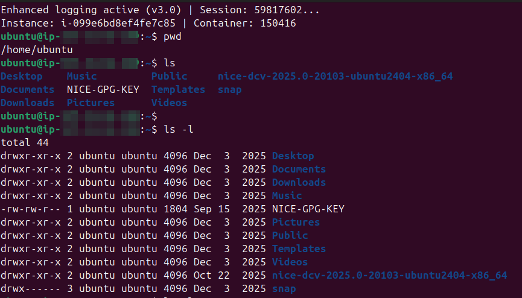
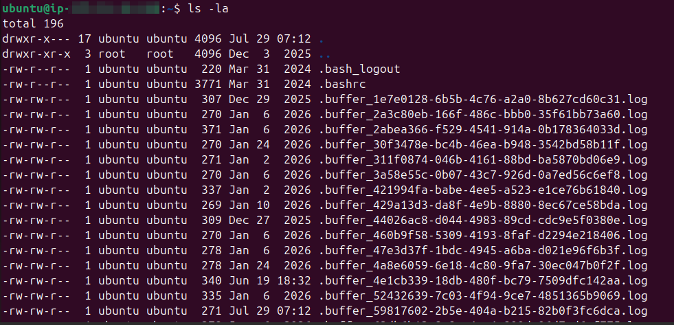
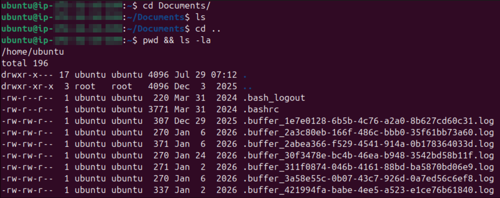

# Lab Name: 1. Navigating the Filesystem

## Objective
Understanding the basic structure of a filesystem

## Tools Used
Ubuntu Terminal Command Line Interface (CLI)

## Commands Used

`ls`
`ls -la`
`pwd`
`cd`
`cd ..`

## Results

The results are attached below:

