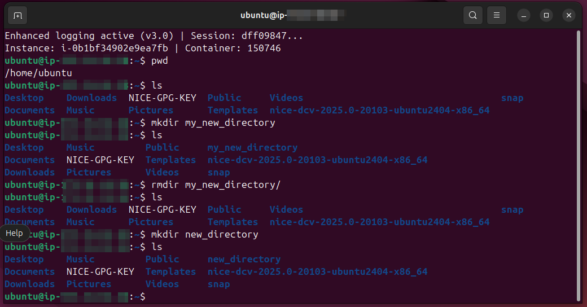
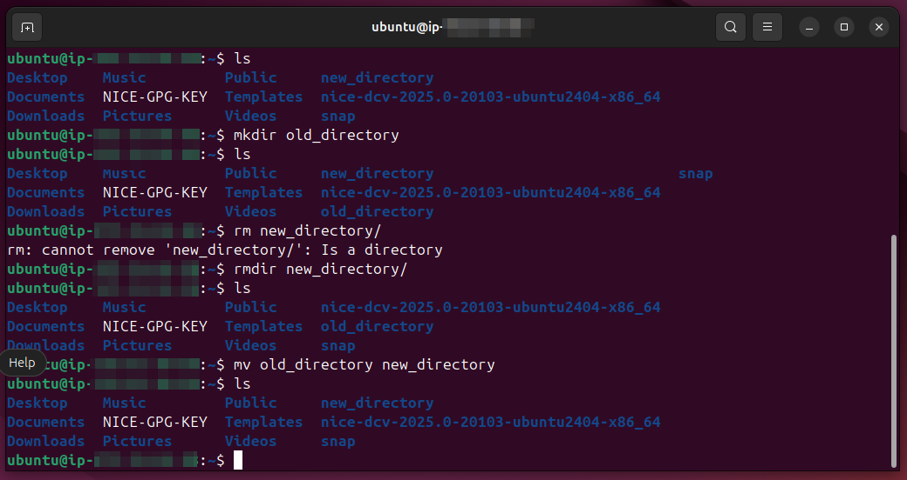
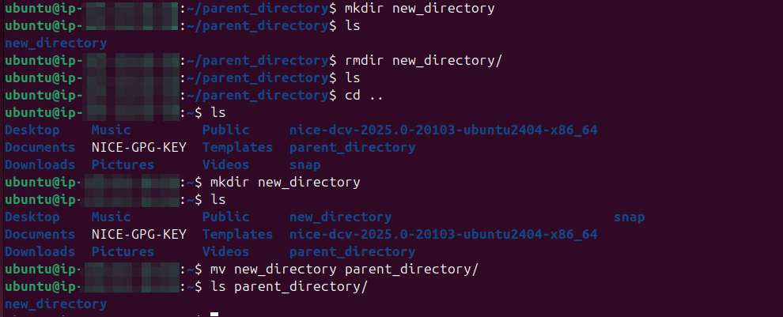

# Lab Name: 2. Working with Directories

## Objective
Understanding the basic operations for managing directories in a filesystem.

## Tools Used
Ubuntu Terminal Command Line Interface (CLI)

## Commands Used

`mkdir` = to create new directories

`rmdir` = to remove empty directories

`mv` = to rename or move files and directories

## Results

The results are attached below:

