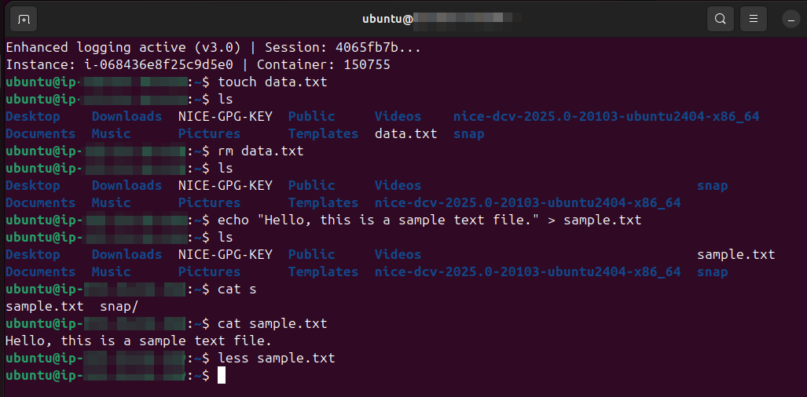
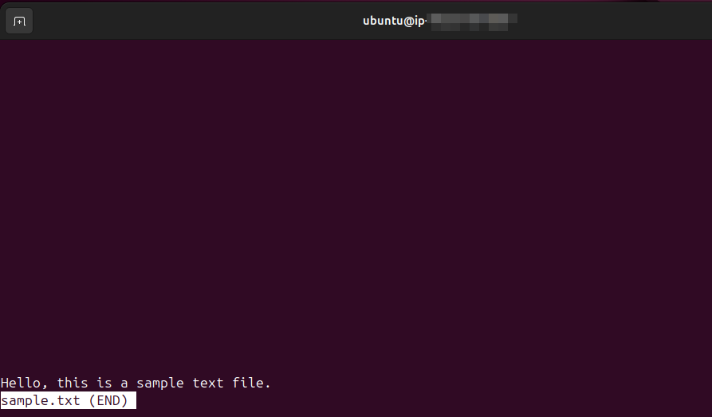

# Lab Name: 3. Managing Files

## Objective

- Demonstrate basic file management tasks in a Unix/Linux environment.

- Familiarize users with creating, viewing, and deleting files using command-line tools.

## Tools Used
Ubuntu Terminal Command Line Interface (CLI)

## Commands Used

`touch` = to create new file

`rm` = to remove a file

`echo` = to print text to the terminal

`cat` = to display file output

`less <filename>` = for paginating viewing of large files, cat is for small files

## Results

The results are attached below:

