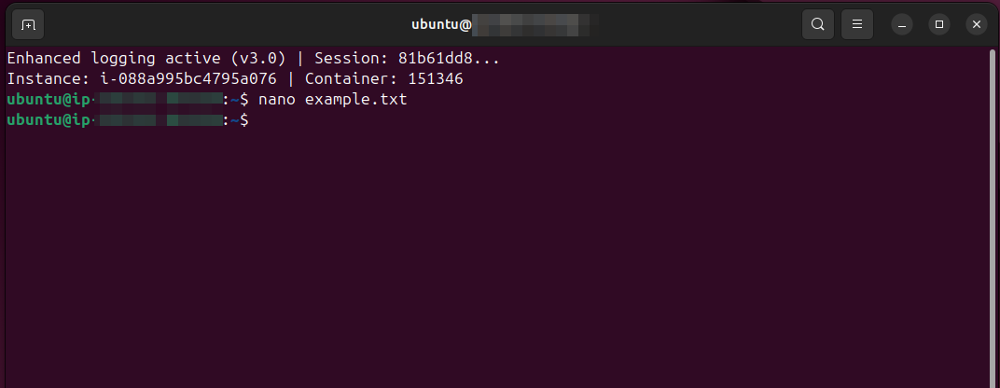
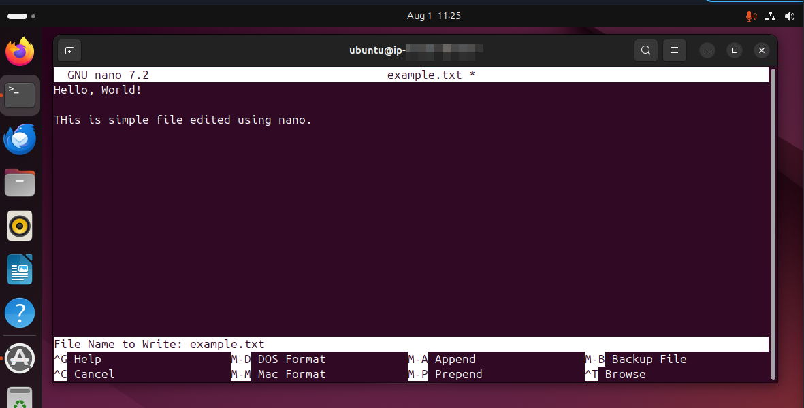
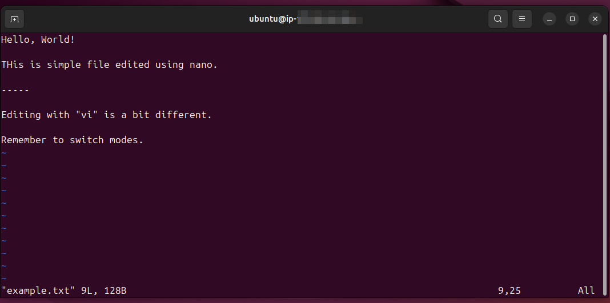
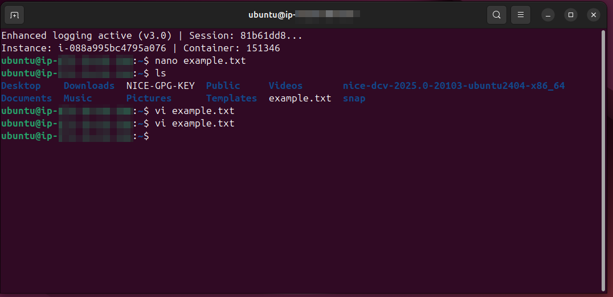

# Lab Name: 4. Using Text Editors

## Objective

- Understand the basic functionalities of text editors such as **nano** and **vi**.

## Tools Used
Ubuntu Terminal Command Line Interface (CLI)

## Commands Used

`nano <filename.txt>` = to create new file with the specified name

`CTRL + O` = to save changes

`CTRL + X` = to exit

---

`vi <filename.txt` = to open file if already present or it will be created on the go

`i` = to enter in the insert mode

`Ese` = to get out from the **insert** mode

`:wq` = to save and quit from the editor

## Results

The results are attached below:

