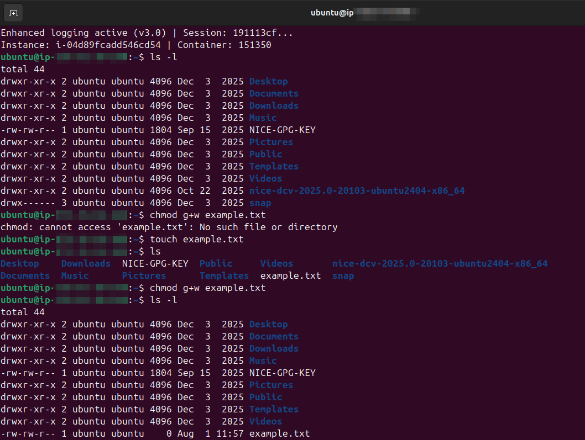
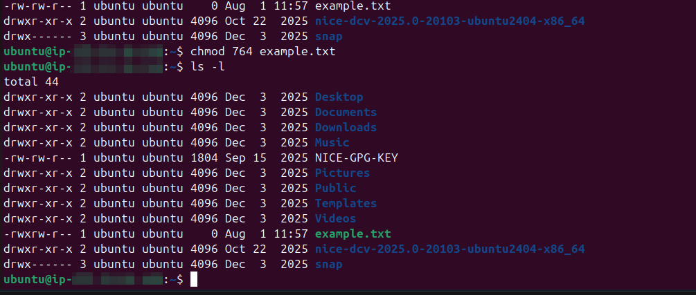

# Lab Name: 5. File Permissions Basics

## Objective

- Understand the concepts of Linux file permissions.

## Tools Used
Ubuntu Terminal Command Line Interface (CLI)

## Commands Used

`ls -l` = to check file permission in detailed listing of directory items

` - ` = if a first character in a line is hypen then it's a file

` d ` = if the first character is **d**  it's directory

`chmod` = to change file permissions

`chmod <file permission tags> <filename>` = syntax to use **chmod** command

`chmod g+w example.txt` = to add write permissions to a group

`r` = this is for read permissions

`w` = this is for write permission

`x` = this is for execute permissions for scripts/programms

*and some commands from the previous labs are used in performing  this lab.*

## Results

The results are attached below:

