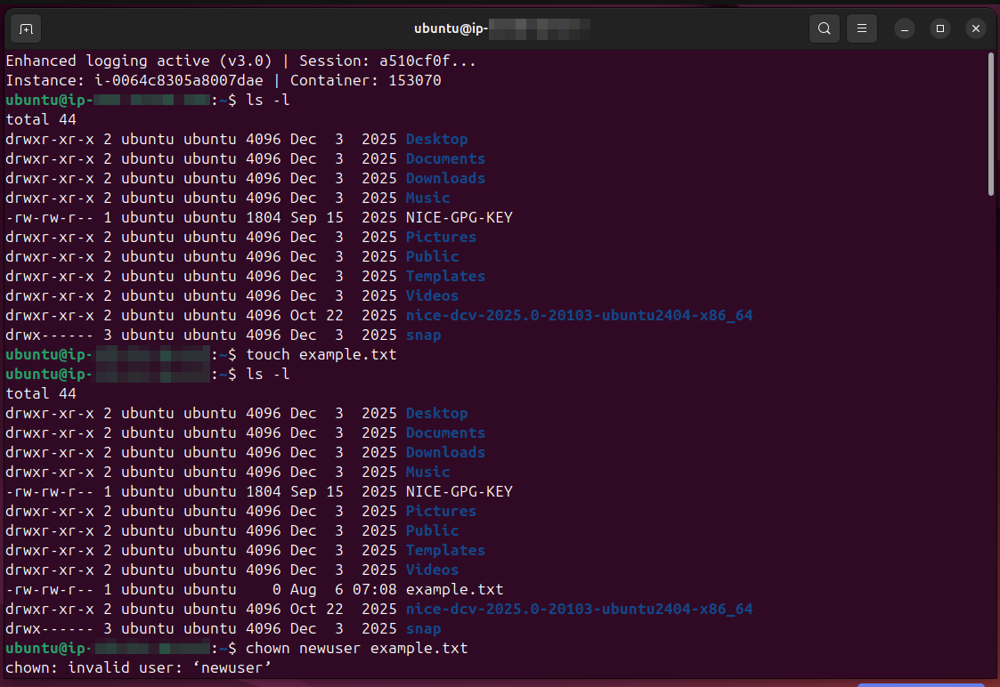
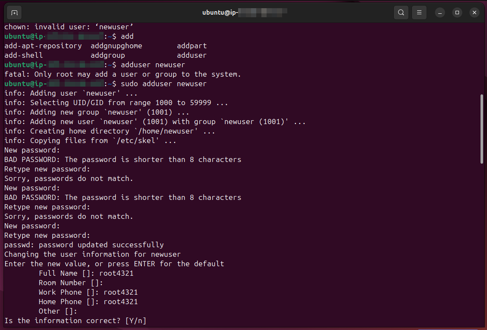
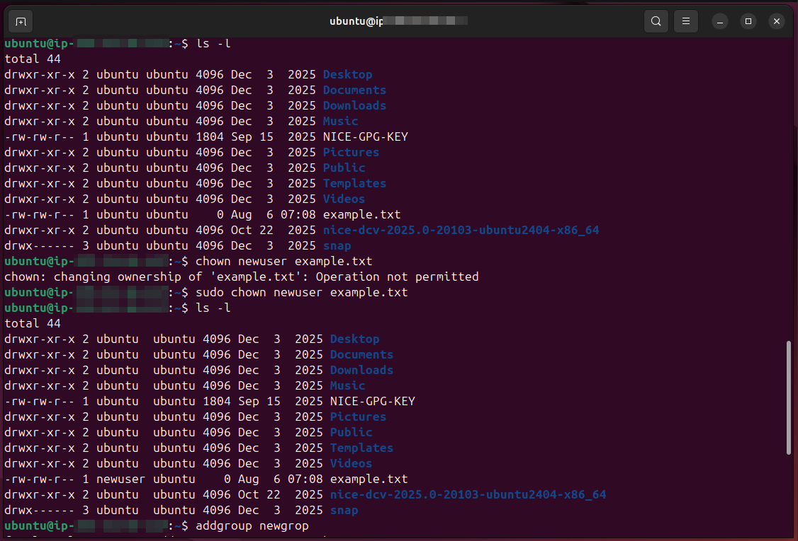
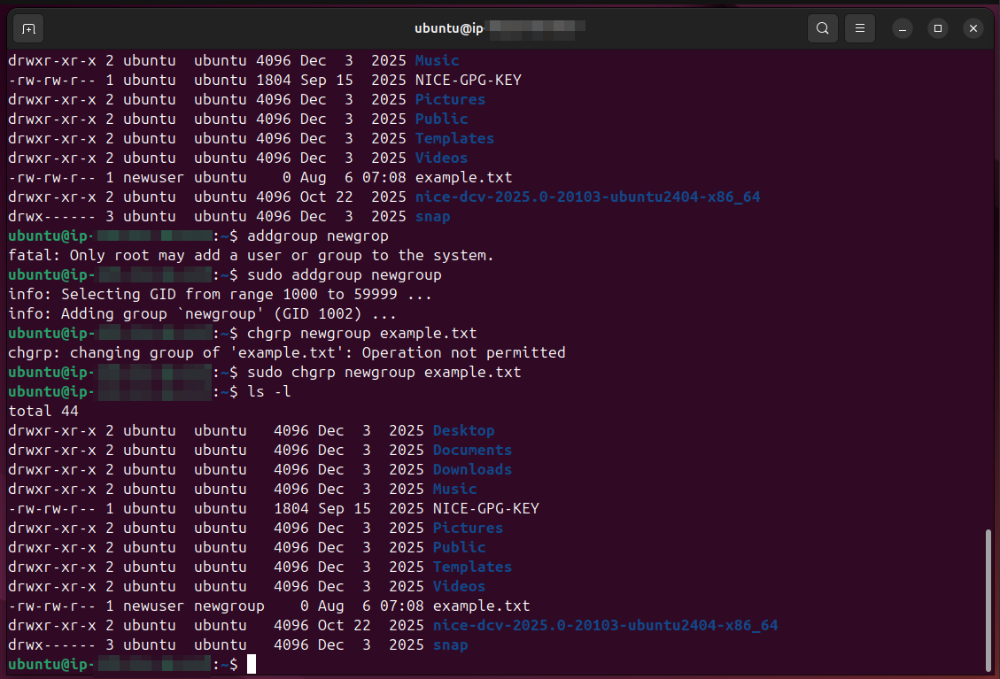

# Lab Name: 6. Working with Ownership

## Objective

- Understand file and directory ownership in Linux.

## Tools Used
Ubuntu Terminal Command Line Interface (CLI)

## Commands Used

`ls -l` = to check file permission in detailed listing of directory items

` chown ` = to change ownerhip of a file

`chown <new-user-name> <filename>.extension` = syntax for **chown**

` chgrp ` = to change ownership of a group

`chgrp <new-group-name> <filename>.extension` = syntax for **chgrp**

*use `sudo` if need root privileges*

## Results

The results are attached below:

