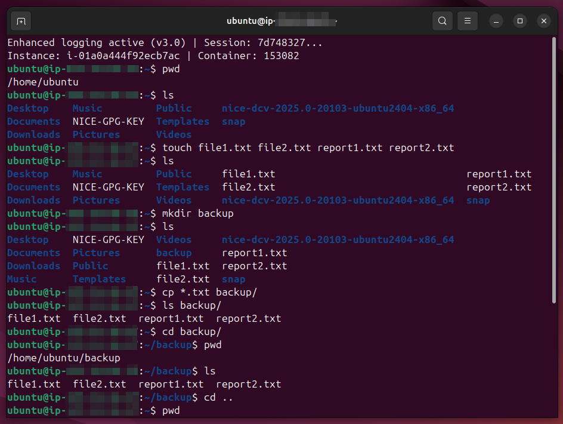
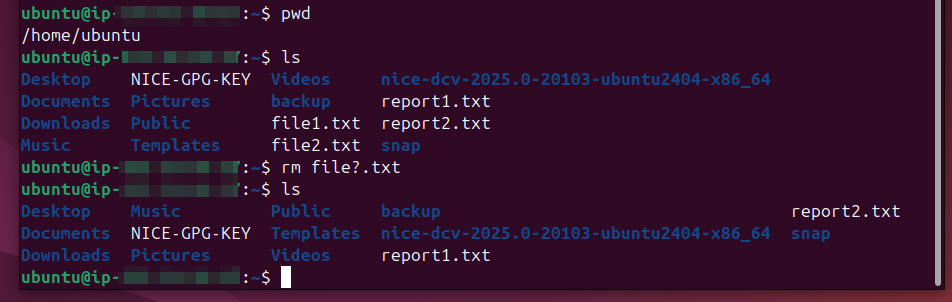

# Lab Name: 7. Using Wild Cards

## Objective

- Understand the concept of wildcards in file management.

## Tools Used
Ubuntu Terminal Command Line Interface (CLI)

## Commands Used

`ls -l` = to check file permission in detailed listing of directory items

` cp ` = to copy a file

`touch` = to create multiple files on the go

` mkdir ` = to create a directory

`rm` = to remove files

` * ` & ` ? ` = wildcards along with `cp` and `rm` to manage files

```markdown
* is greedy and flexible: 

It doesn't care how many characters are present—it matches zero, one, or a hundred characters.

ls doc* matches doc, docx, document.txt, and documentation_2026.pdf.

? is exact and strict: 

It acts as a single-character placeholder—it must match precisely one character.

ls doc? matches docx or doc1, but ignores doc (too short) and document (too long).
```

*some commands were also used from the previous labs*


## Results

The results are attached below:



