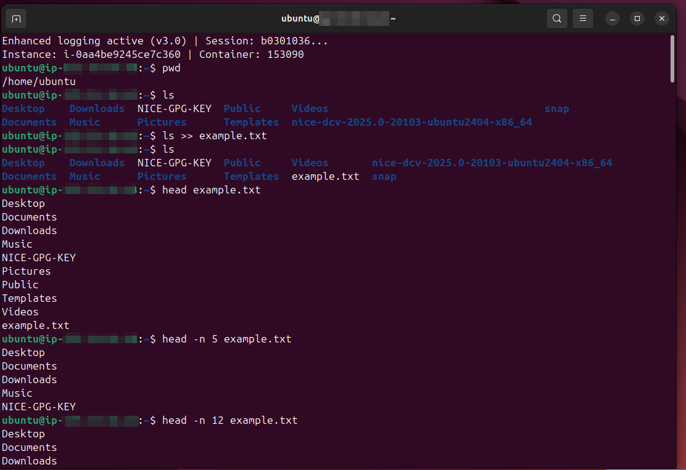
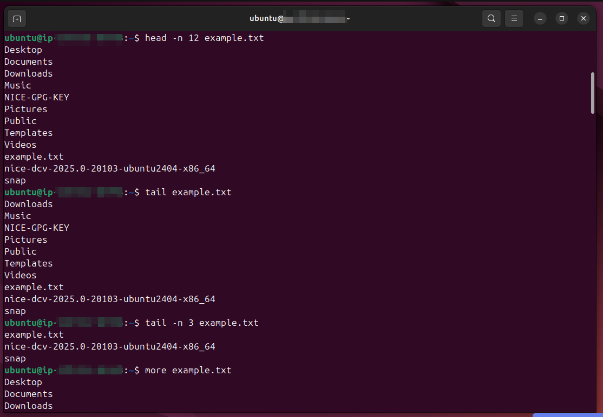
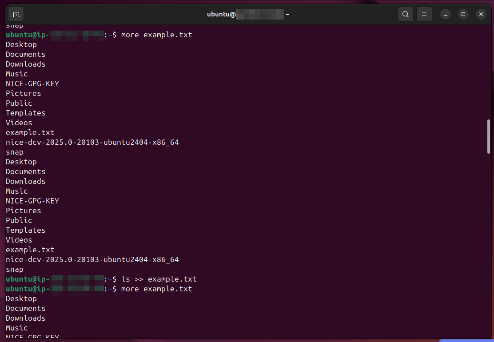
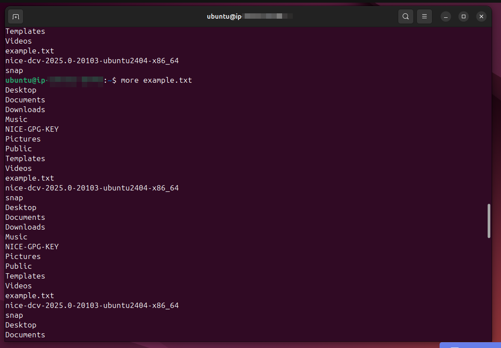
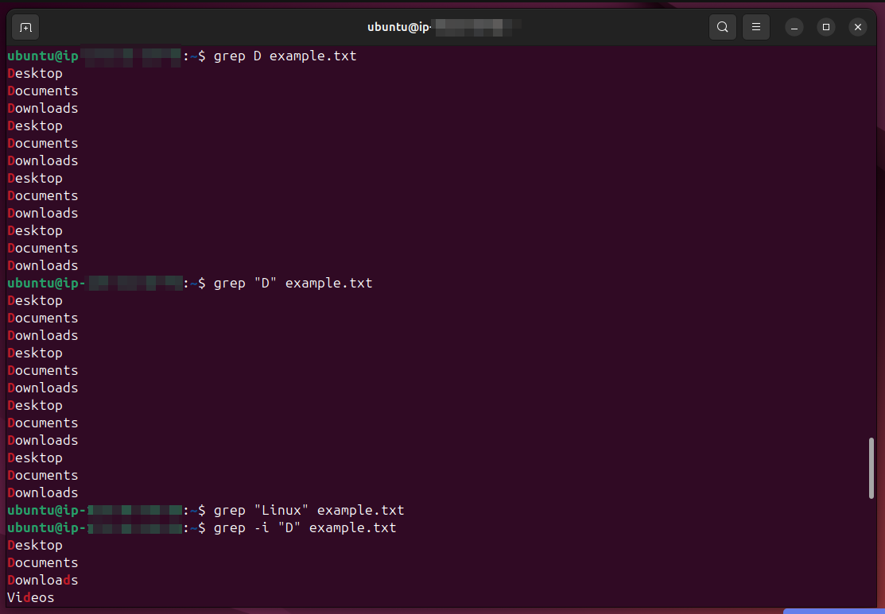
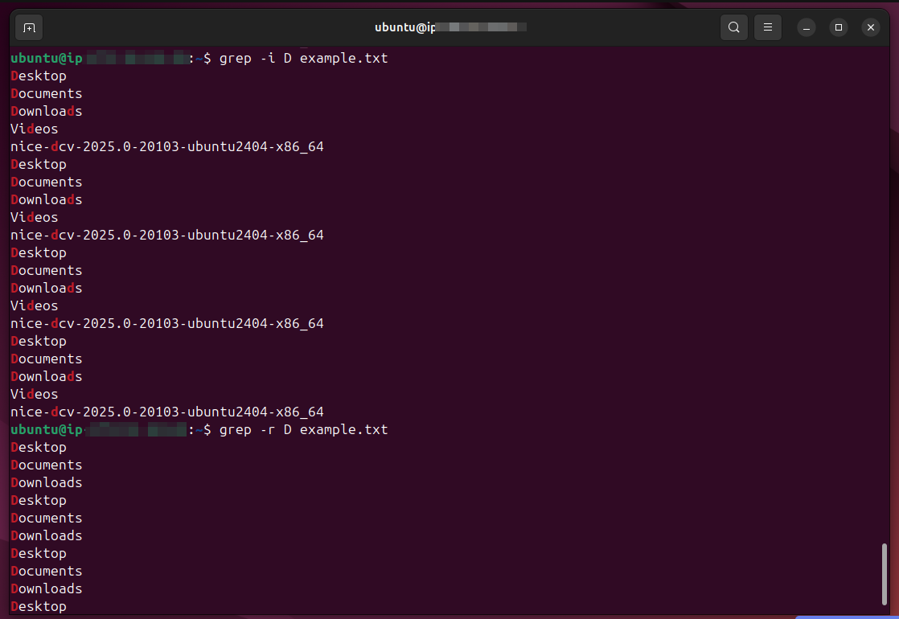

# Lab Name: 8. Viewing File Contents

## Objective

- Familiarize with basic commands for viewing file contents in a Linux terminal.

## Tools Used
Ubuntu Terminal Command Line Interface (CLI)

## Commands Used

`ls -l` = to check file permission in detailed listing of directory items

` cp ` = to copy a file

`touch` = to create multiple files on the go

` mkdir ` = to create a directory

`rm` = to remove files

` * ` & ` ? ` = wildcards along with `cp` and `rm` to manage files

*some commands were also used from the previous labs*

## Results

The results are attached below:

