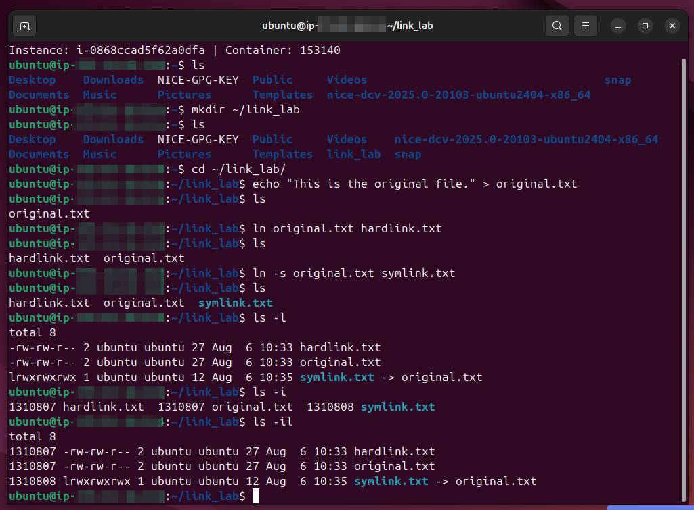

# Lab Name: 9. Working with Links   

## Objective

- Understand the difference between hard links and symbolic links.

## Tools Used
Ubuntu Terminal Command Line Interface (CLI)

## Commands Used

`ln` = to create hard links or soft links (symbolic links)

` ln <original.txt> <hardlink.txt> ` = to create a hardlink.txt file that points to original.txt file

` ln -s <original.txt> <symlink.txt> ` = to create a symbolic ilnk (soft link)

` ls -i ` = to list inode numbers of the files

### Hard Links vs. Symlinks Summary

- **Hard Link:** A direct label to the physical data on disk (same inode); if the original file is deleted, the data remains accessible through the hard link.
- **Symlink (Soft Link):** A shortcut file containing a text path to another file or directory; if the target file is deleted or moved, the symlink breaks.
- **Key Difference:** Hard links only work for files on the same drive partition, whereas symlinks can point across different drives, network shares, and directories.

| Feature | Hard Link | Symbolic Link (Symlink) |
| :--- | :--- | :--- |
| **Points To** | Direct data on disk (Inode) | Path of another file/directory |
| **Inode Number** | Same as original file | Unique inode number |
| **If Original File Deleted** | Data is safe & accessible | Link breaks (dangling link) |
| **Supports Directories** | No | Yes |
| **Cross Partition/Drive** | No | Yes |
| **Creation Command** | `ln target link_name` | `ln -s target link_name` |

*- some commands were also used from the previous labs.*

## Results

The results are attached below:

