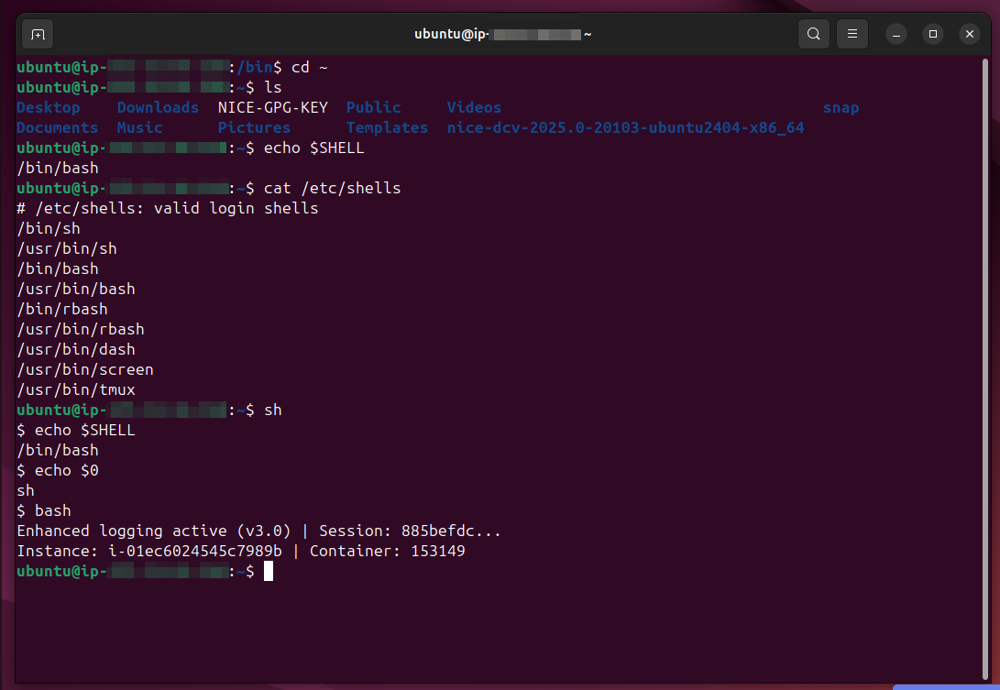

# Lab Name: 10. Understanding Shells  

## Objective

- Understand the concept and purpose of a shell in Unix-like operating systems.

## Tools Used

Ubuntu Terminal Command Line Interface (CLI)

## Commands Used

`echo $SHELL` = to show the current shell

` cat /etc/shells ` = to read/show all the avaialble shells on the system

` sh ` = to switch to the **sh shell** simply use this command

` echo $0 ` = it will show the current shell name 

*- some commands were also used from the previous labs.*

## Results

The results are attached below:

