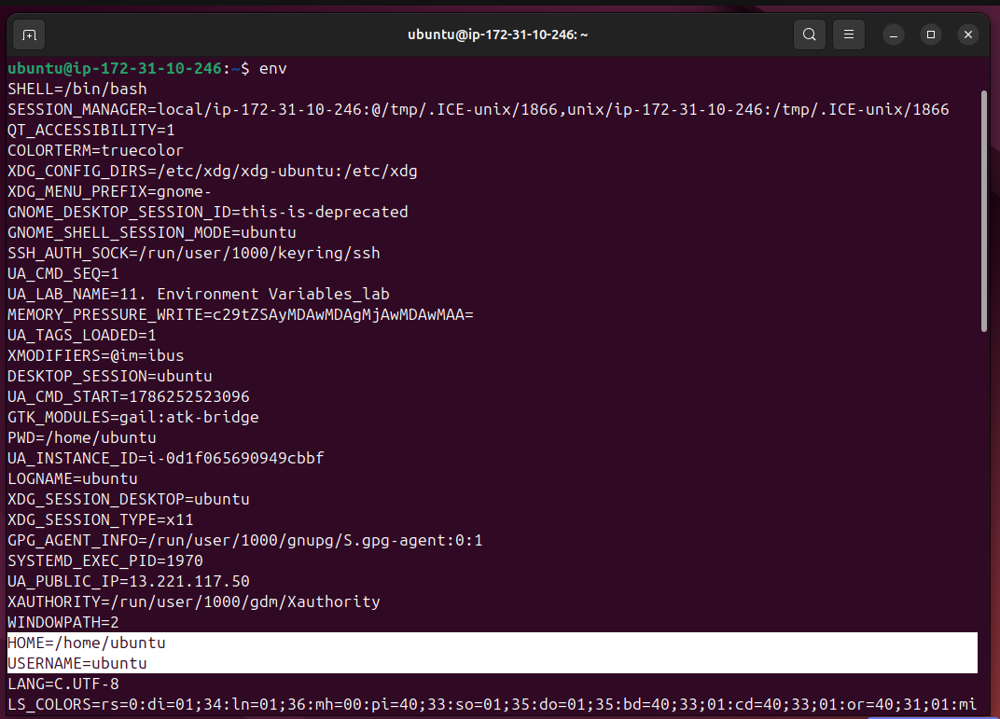
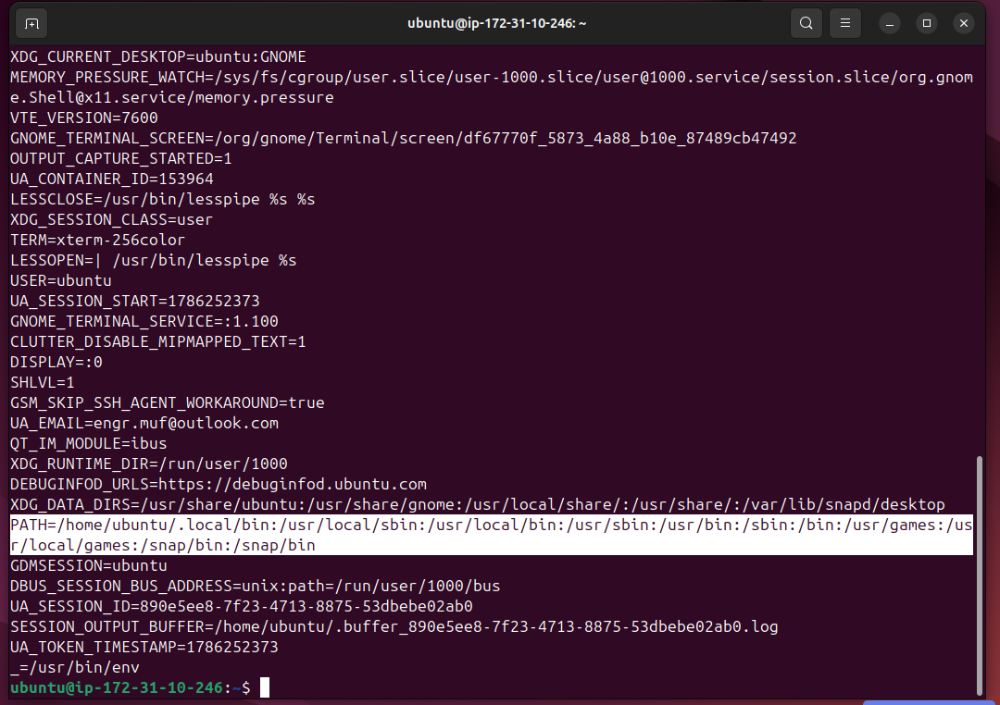
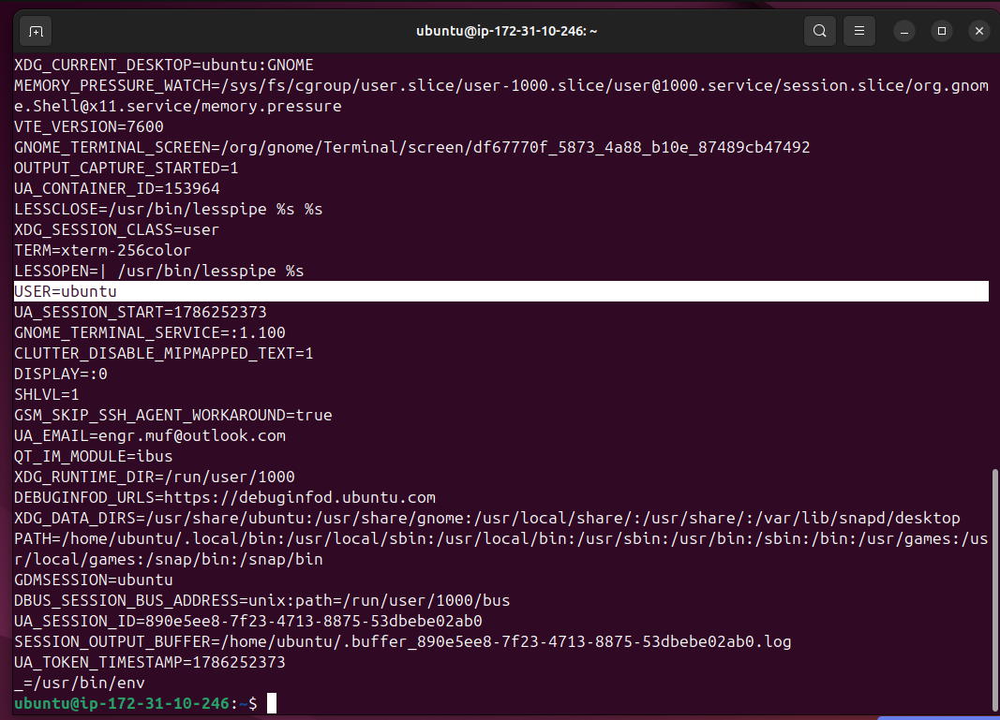
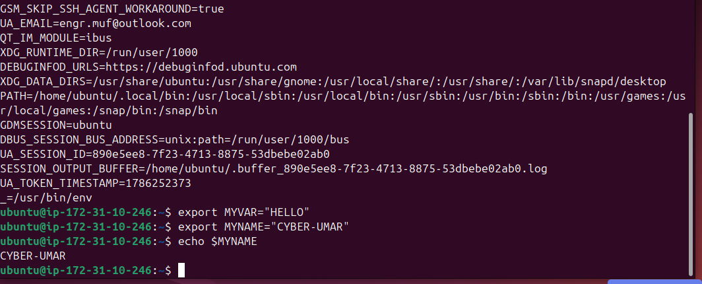
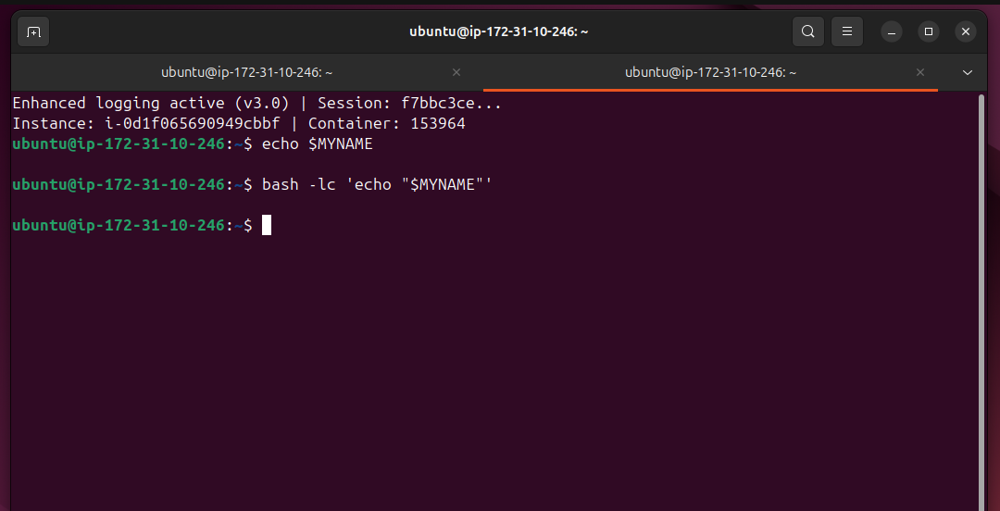
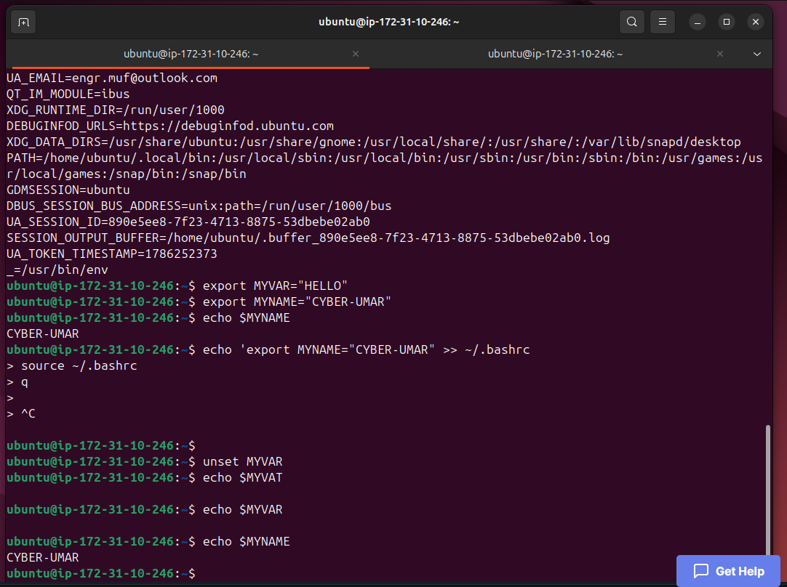

# Lab Name: 11. Environment Variables

## Objective

- Understand what environment variables are and how they function within an operating system.

## Tools Used

Ubuntu Terminal Command Line Interface (CLI)

## Commands Used

` env ` = to view current environment variables

``` in  current shell session. Each environment variable is shown as a line with the format `KEY=VALUE`. ```

` export MYVAR = "HELLO" ` = to create an environment variable MYVAR with the value HELLO.

` export MYNAME = "CYBER-UMAR" ` = to create an environment variable MYNAME with the value CYBER-UMAR.

` echo $MYNAME ` = to check the presense of any env variable here is MYNAME.

` unset MYVAR ` = to remove an env variable

*- some commands were also used from the previous labs.*


## Results

The results are attached below:













