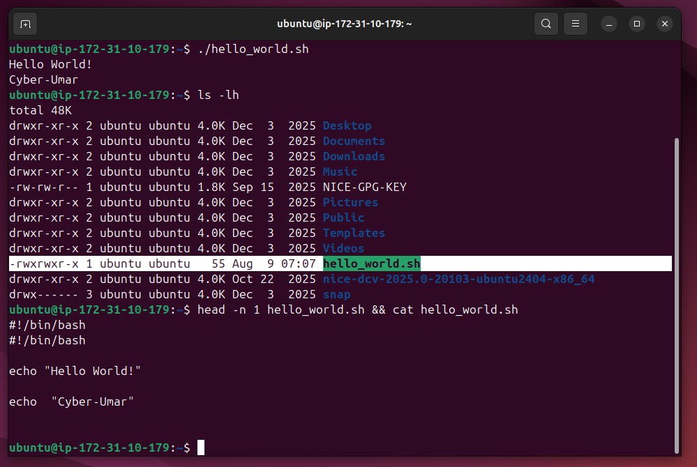

# Lab Name: 12. Basic Shell Scripting

## Objective

- Understand the basics of shell scripting.

## Tools Used

Ubuntu Terminal Command Line Interface (CLI)

## Commands Used

` nano hello_world.sh ` = to create a file **hello_world.sh** and editing in **nano editor**.

` #!/bin/bash ` =  added the shebang at the top of the file to specify the script interpreter.

```
A shebang (also called a hashbang) is the character sequence #! at the absolute beginning of a script file in Unix-like operating systems (Linux, macOS).

It tells the system's program loader which interpreter to use to execute the rest of the script.

Basic Syntax 

#!/path/to/interpreter [optional-arg]
```

`./hello_world.sh` = to run the specified script

*- some commands were also used from the previous labs.*


## Results

The results are attached below:



