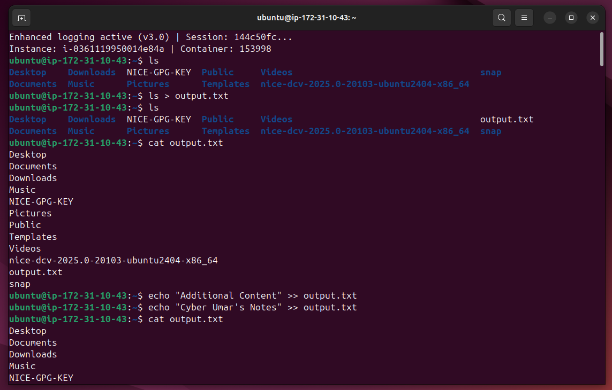
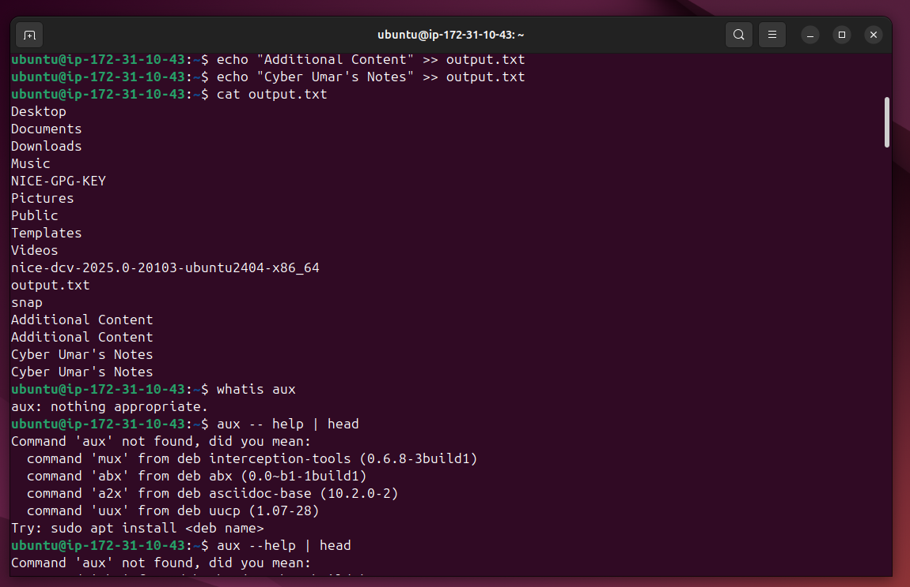
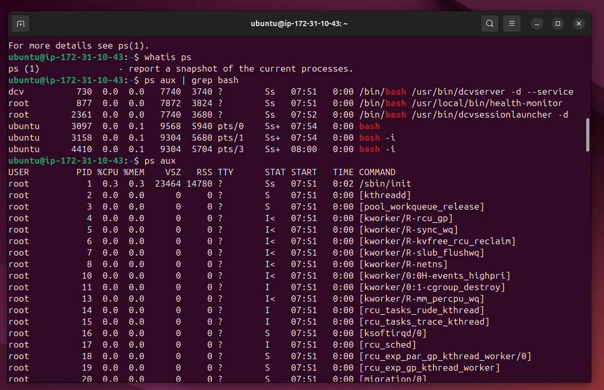

# Lab Name: 13. Using Piping and Redirection

## Objective

- Understand the concept of input/output redirection in Linux.

## Tools Used

Ubuntu Terminal Command Line Interface (CLI)

## Commands Used

` ls > output.txt ` = the operator **>** redirects the output to a file.

` echo "Additional content" >> output.txt ` =  the append operator **>>** add output to the end of an existing file without overwriting it.

` | ` = It's called pipe. 

```

Piping is a technique to pass the output of one command as the input to another. Using pipes, we can combine several small commands to perform powerful operations, such as filtering data.

```

` ps aux | grep bash ` = ps is to display processess with it's flags **aux** to make the output easily readable. Then we are piping the output to see filtered results containing the word **bash** only.

*- some commands were also used from the previous labs.*


## Results

The results are attached below:







