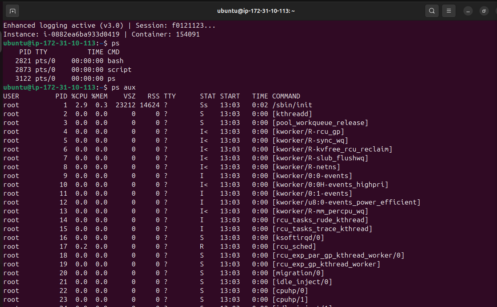
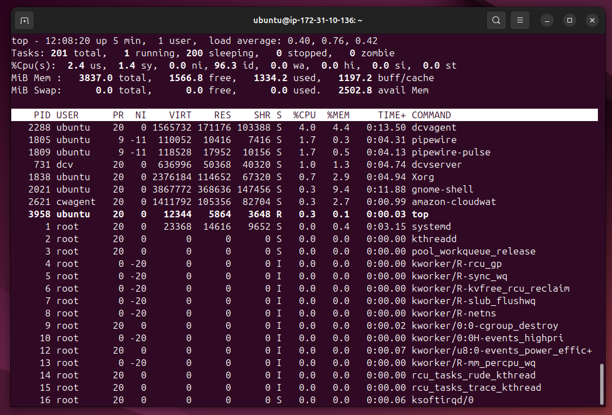
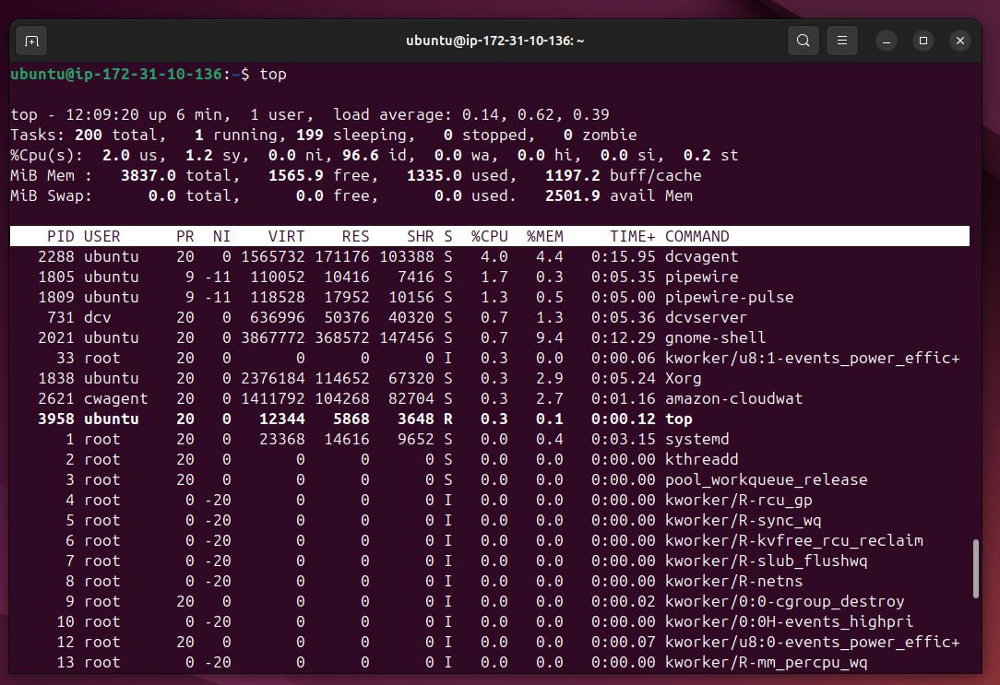
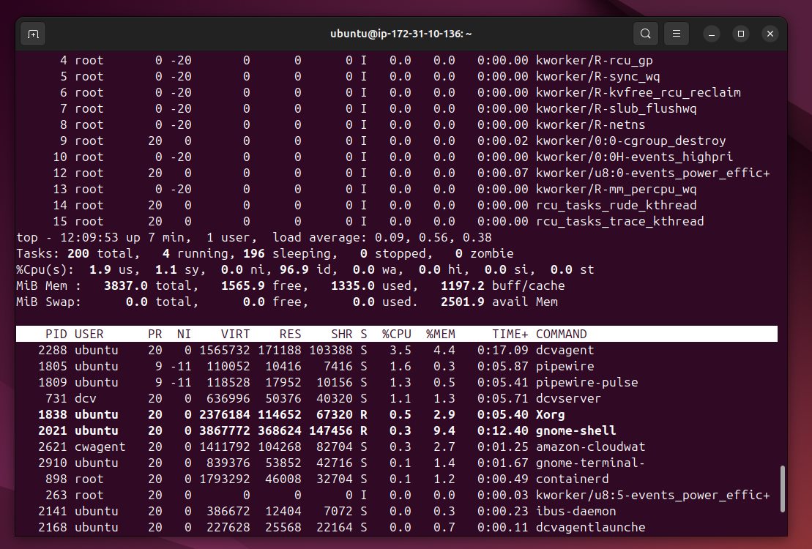
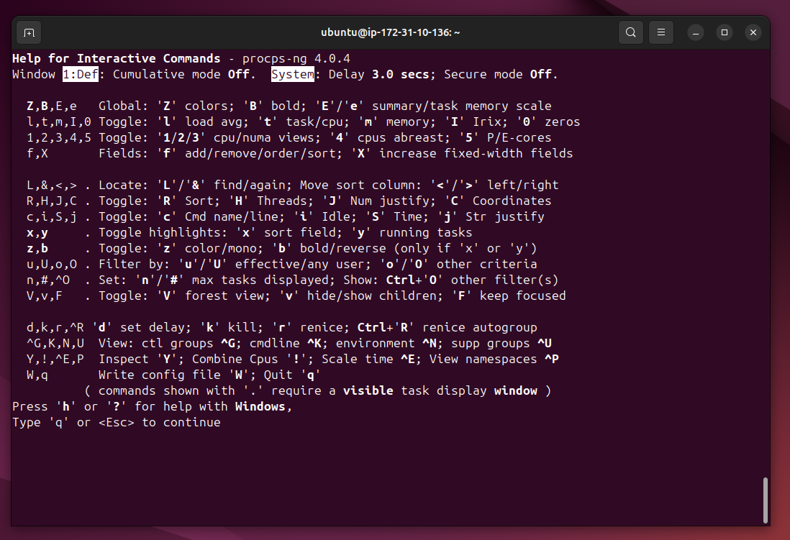
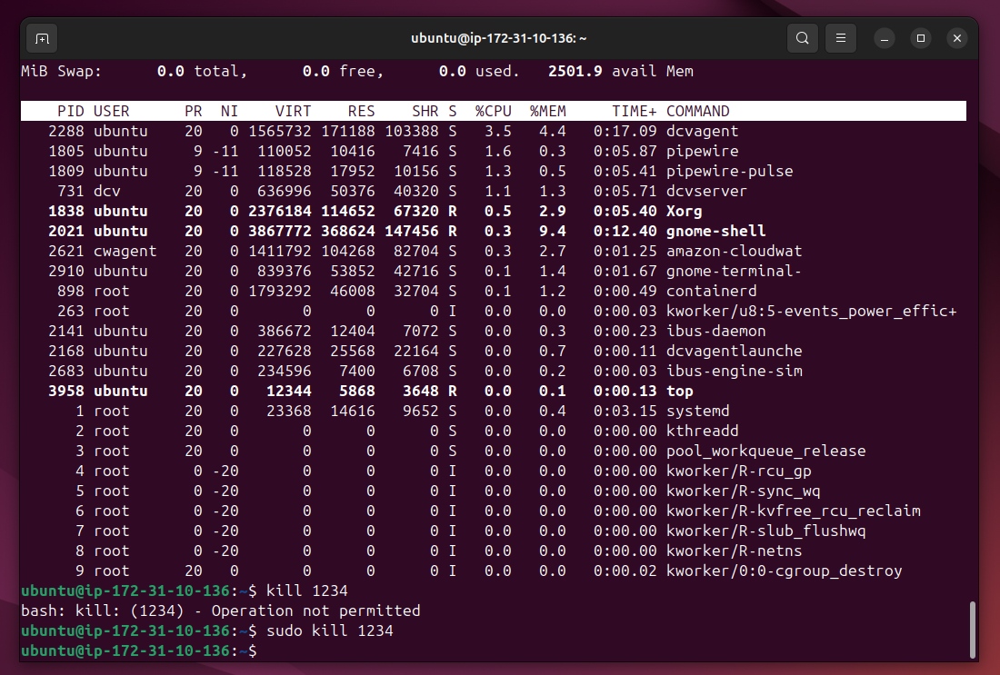
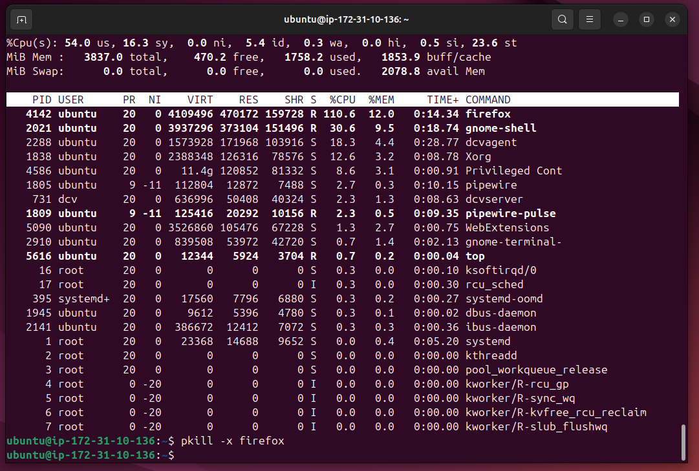
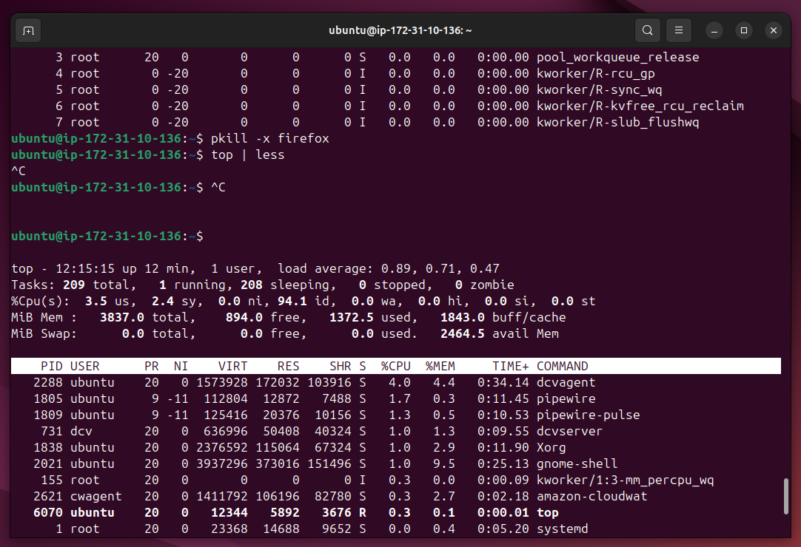

# Lab Name: 14. Basic Process Management

## Objective

- Understand the basics of process management in a Unix/Linux environment.

## Tools Used

Ubuntu Terminal Command Line Interface (CLI)

## Commands Used

` ps ` = shows snapshot of current processess, not the live processes

` ps aux ` 

a: Display information about all users.
u: Provide a detailed listing.
x: Show processes without controlling terminals.

` top ` =  provides a real-time view of processes. **q** for quit and **h** for help.

` kill ` = to kill processes. format is ` kill <pid> `

` kill -9 <PID> ` = to send stronger signal to kill processes if the process is not being closed. -9 represents SIGKILL (signal number 9 which is signal kill)

` pkill -x <process_name> ` = to kill processes based on names not on PID (process ID)

*- some commands were also used from the previous labs.*

## Results

The results are attached below:

