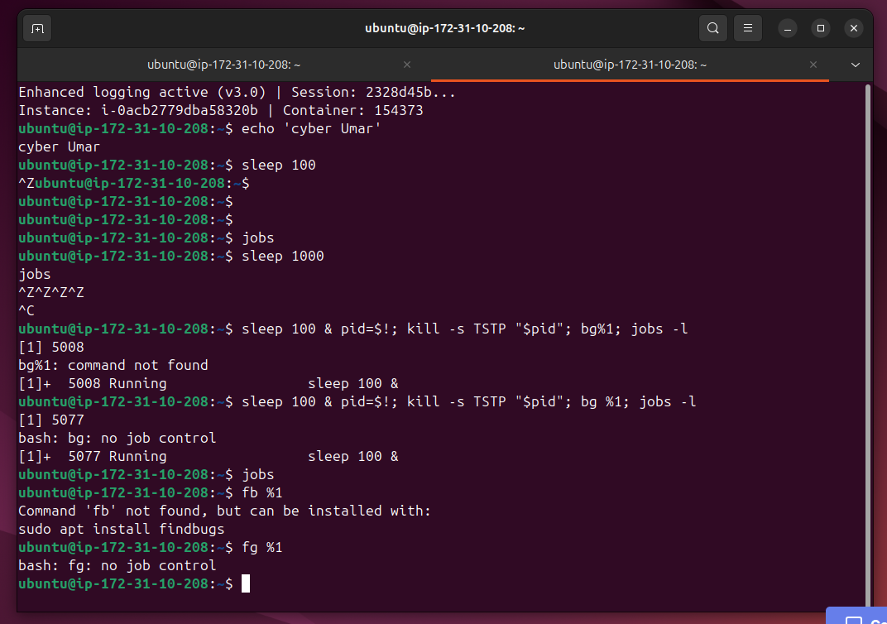
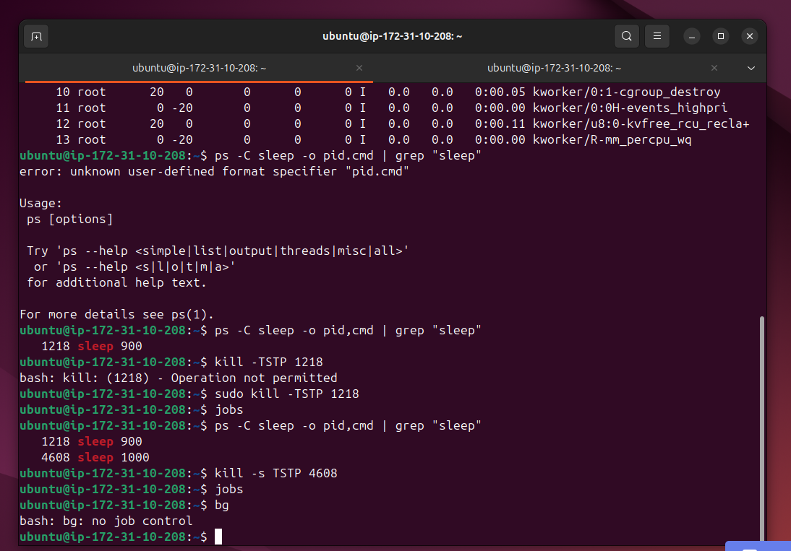
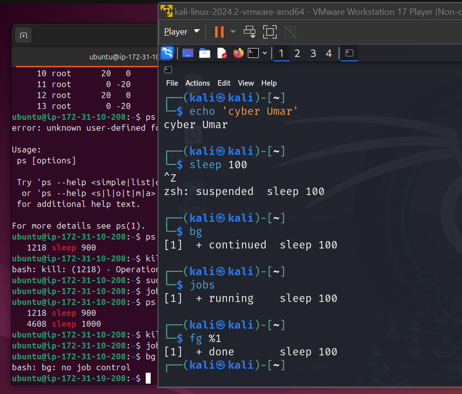
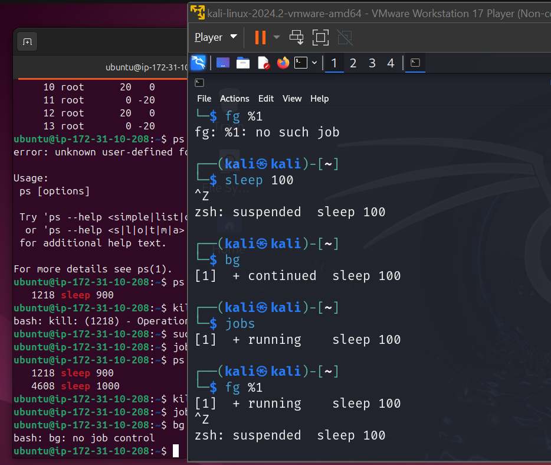

# Lab Name: 15. Job Control Basics

## Objective

- Understand the concept of job control in Unix/Linux operating systems.
- Learn how to manage background and foreground processes.

## Tools Used

Ubuntu Terminal Command Line Interface (CLI)

Kali Linux Terminal Command Line Interface (CLI)

## Commands Used

` sleep 100 ` = this command pauses the terminal for a specified amount of time. here it is 100 seconds.

` Ctrl+Z `  = is a job control signal that suspends the currently running foreground process and turns it into a stopped job in the background, so we can use the terminal for other tasks. Or we can open another tab in the same terminal to do other tasks.

` bg ` =  to resume the suspended job in the background, it stays in the background.

` jobs ` = to list all the current active jobs 

` [1]+  Running                 sleep 100 ` = this is the example output of `job` command. the [1] is job ID.

` fg %1 ` = to bring the process  to the foreground. the **%1** is the job ID of the concerned process.

*Kali Linux was used because the Ctrl+Z command was not working in the lab portal. Even after connecting via SSH in MobaXterm, the command still did not work. After several tests, the same lab ran successfully in the Kali Linux CLI. Please see screenshots 3 and 4.*

*- some commands were also used from the previous labs.*

## Results

The results are attached below:

