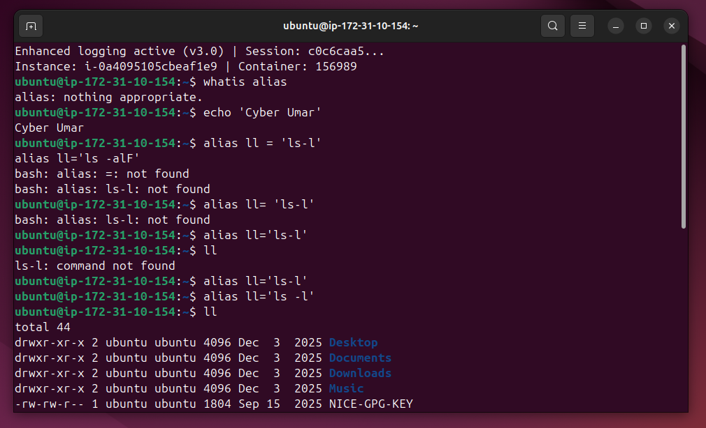
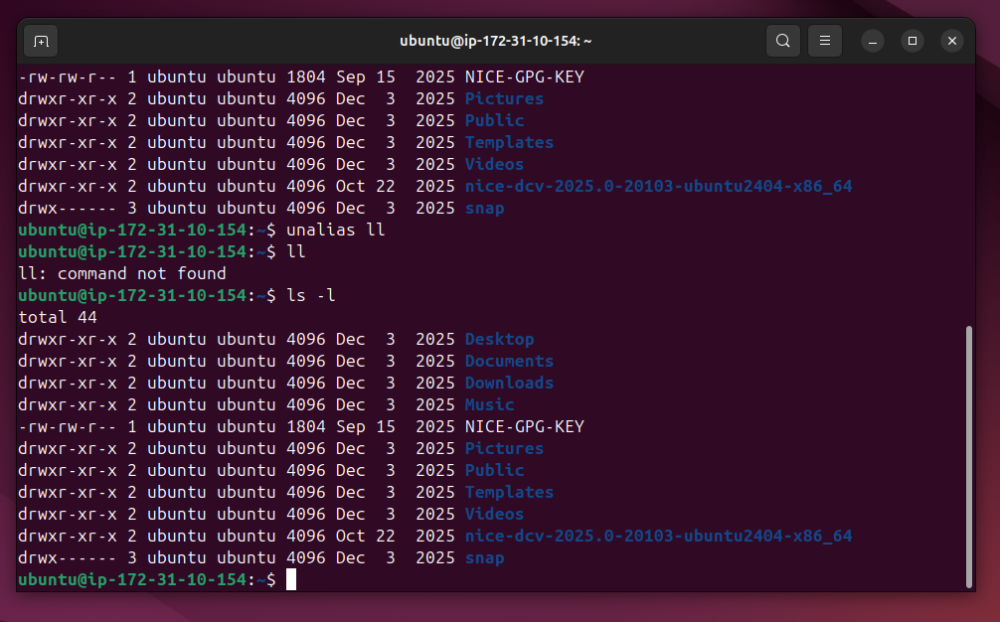

# Lab Name: 16. Using Aliases

## Objective

- Understand the concept of aliases in Linux.

## Tools Used

Ubuntu Terminal Command Line Interface (CLI)

## Commands Used

` alias ` = An alias in Linux is a shortcut to a command or series of commands.

` alias ll='ls -l' `  = this will make a shortcut command `ll` for the command `ls -l`. This is usefull if we don't have to remember a long complex command.

` ll ` =  Now running `ll` command will execuate the `ls -l` command.

` unalias ll ` = this will remove our shortcut command i.e. `ll`

## Results

The results are attached below:

