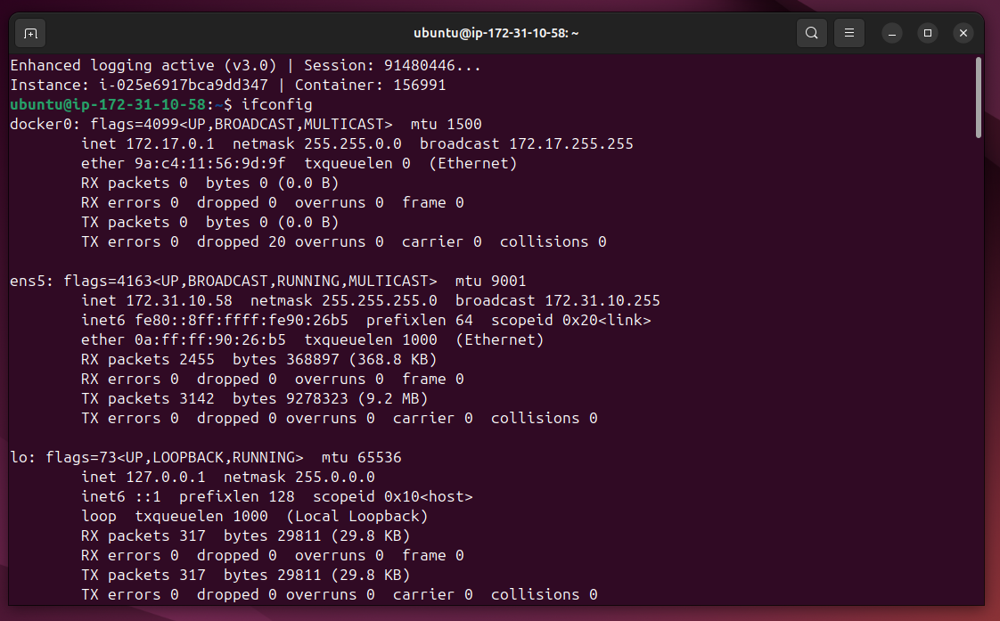
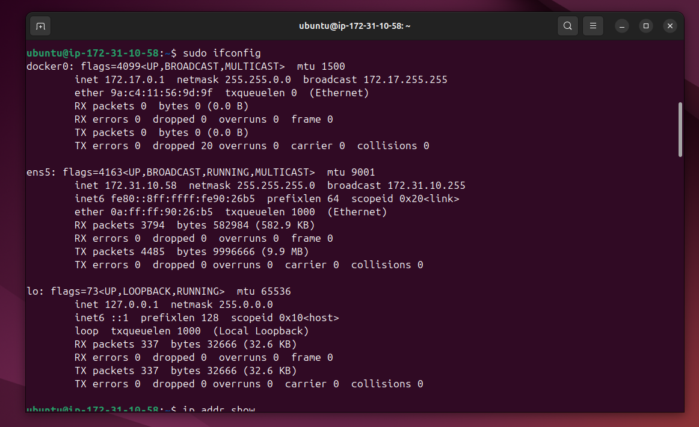
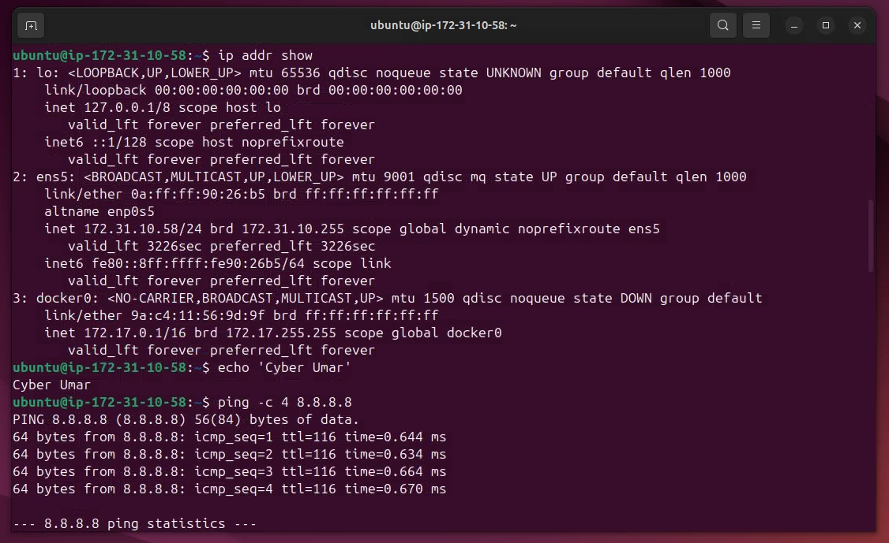
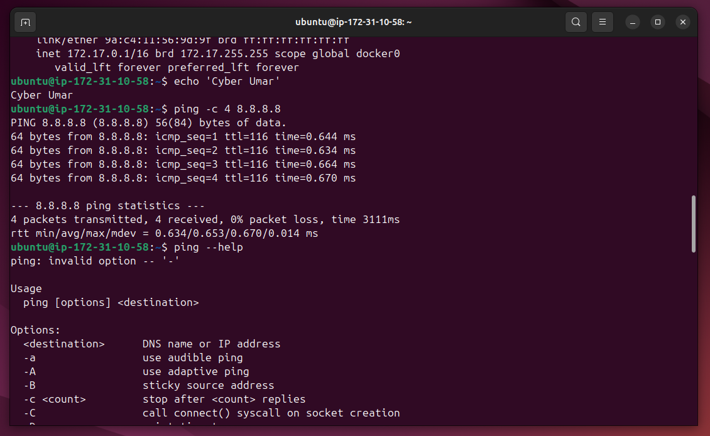
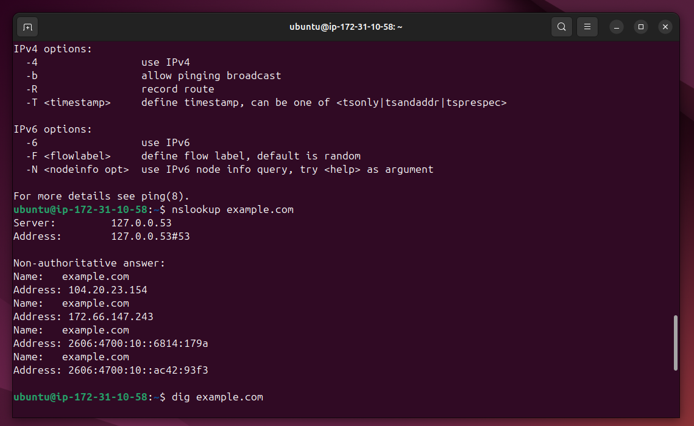
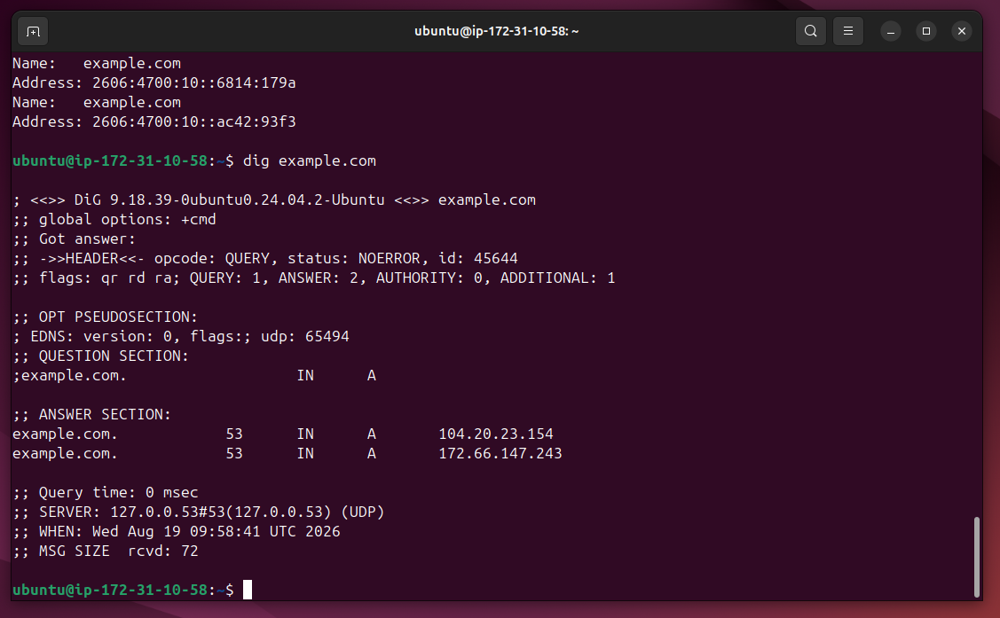

# Lab Name: 17. Network Tools Overview

## Objective

- Understand network configuration settings using `ifconfig` and `ip addr` and test network connectivity using `ping`. Explore domain name system (DNS) information using `nslookup` and `dig`.

## Tools Used

Ubuntu Terminal Command Line Interface (CLI)

## Commands Used

` ifconfig ` = to configure and display of network interface settings.

` ip addr show `  = For detailed network configuration

` ping -c 4 8.8.8.8 ` =  to test network connectivity, ` -c ` flag to fix the number of counts for ping.

` nslookup example.com ` = tp query DNS information of a domain.

` dig example.com ` = for flexible option for DNS querying.

## Results

The results are attached below:

