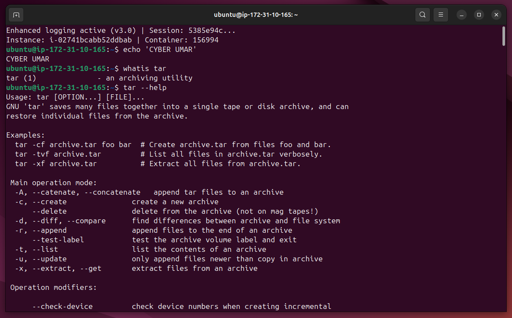
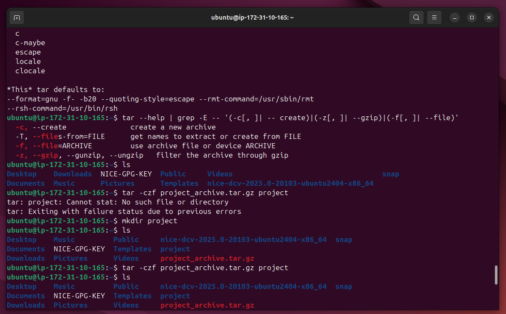
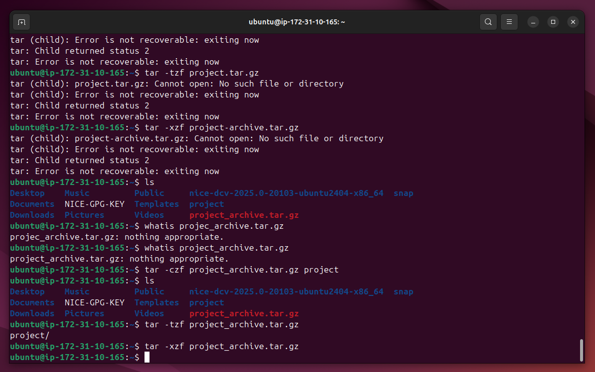

# Lab Name: 18. Archiving with tar

## Objective

- Understand how to create and extract compressed tar archives.

## Tools Used

Ubuntu Terminal Command Line Interface (CLI)

## Commands Used

` tar ` = Tape Archive, for archiving files like 7zip and WinZip. Use with other commands/tools for compressing the size like **gzip**.

` tar -czf project_archive.tar.gz project `  = to archive a folder named **project** in current directory

``` tar: The command to execute tape archive operations.
-c: Create a new archive.
-z: Compress the archive using gzip.
-f: Specifies the name of the archive.
project_archive.tar.gz: The name of the compressed archive file.
project: folder or file name to archive and compress.
```

` tar -tzf project_archive.tar.gz ` = to list contents of the concerned file here **project_archive.tar.gz**, **t** is for listing

` tar -xzf project_archive.tar.gz ` = to extract contents of the concerned file here **project_archive.tar.gz**, **x** is for listing


## Results

The results are attached below:







