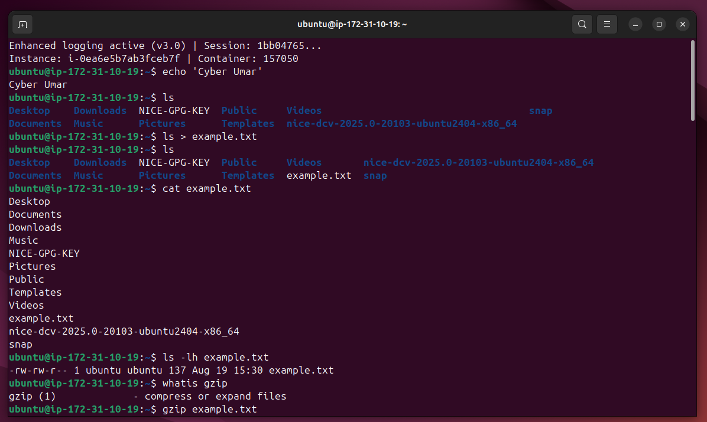
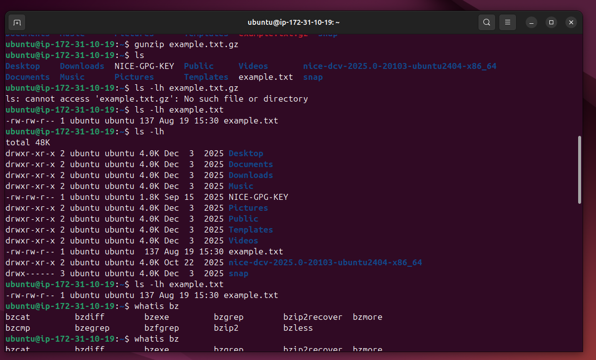
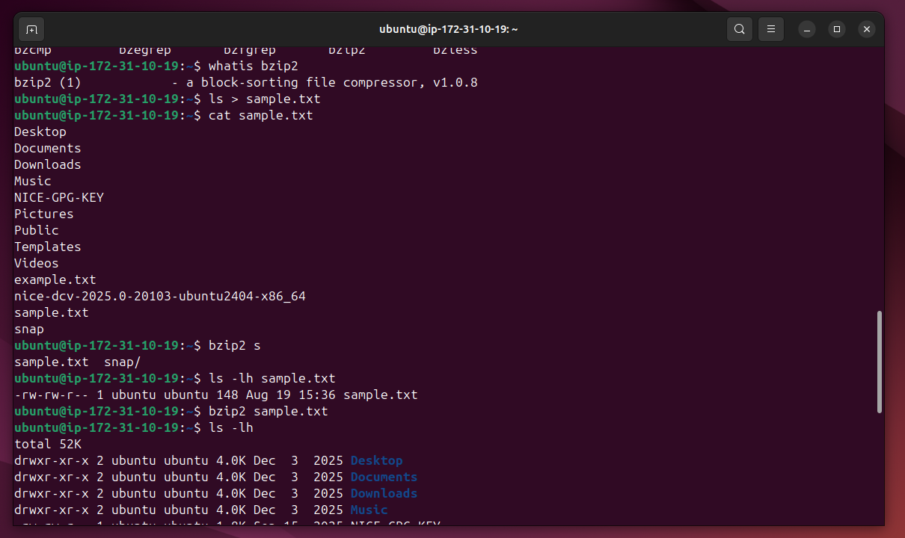
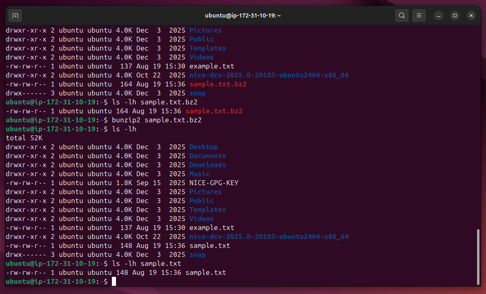

# Lab Name: 19. Compressing with gzip and bzip2

## Objective

- Understand the basics of file compression and decompression with `gzip` and `bzip2`

## Tools Used

Ubuntu Terminal Command Line Interface (CLI)

## Commands Used

` gzip ` = short for GNU Zip, is a popular data compression program

` gzip <filename.txt` = format to use this command

```
After compression, the original file will be replaced by a **.gz** file.
```

` gunzip ` = is used to decompress .gz files.

` gunzip example.txt.gz ` = format to unzip

---
` bzip2 `= provides a higher compression ratio compared to **gzip**, often at the cost of slower compression speeds. Format is same as above.

` bunzip2 ` = decompresses **.bz2** files. The format is same as above.


## Results

The results are attached below:









