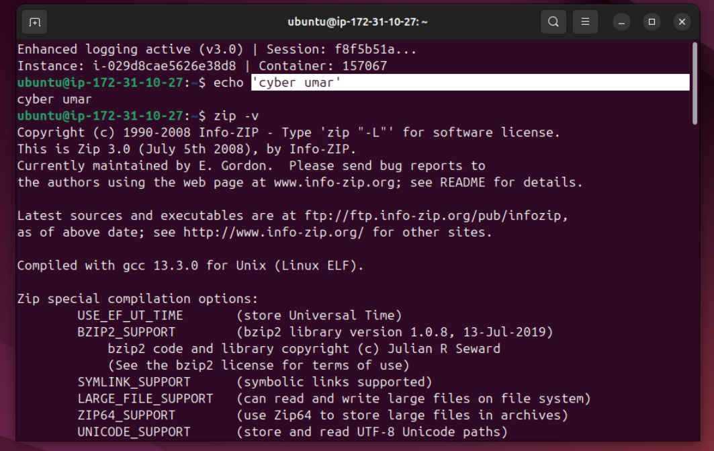
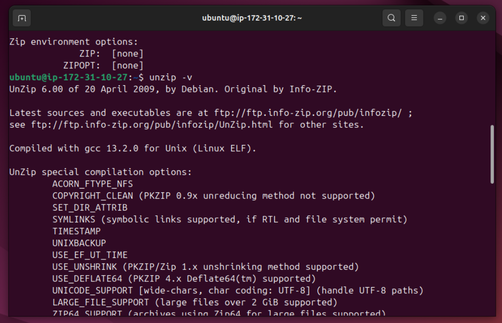
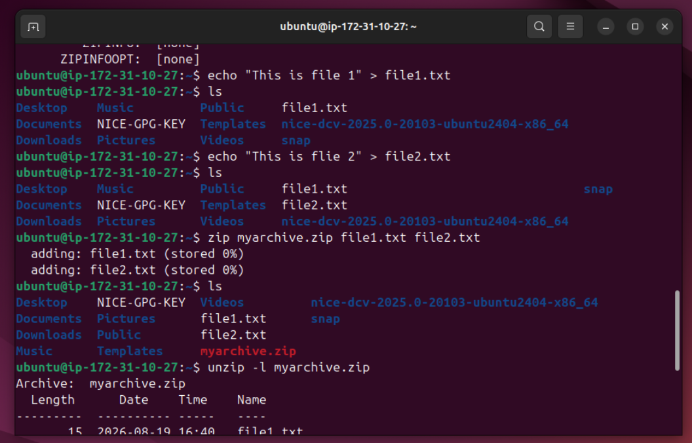
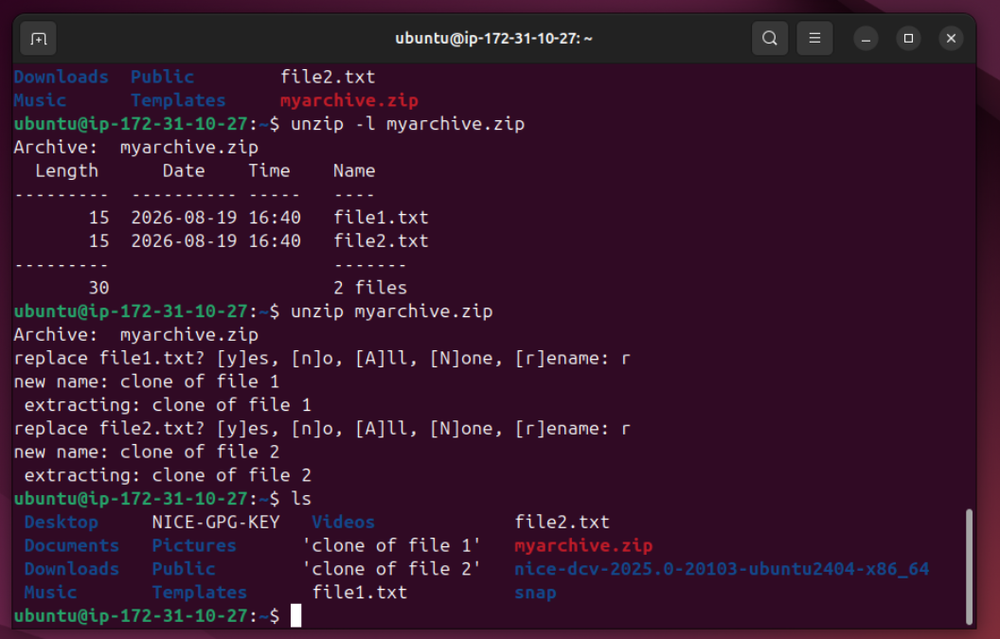

# Lab Name: 20. Working with zip_unzip  

## Objective

- Understand how to use the zip and unzip commands to compress and decompress files.

## Tools Used

Ubuntu Terminal Command Line Interface (CLI)

## Commands Used

` zip -v ` ` unzip -v ` = to check version of zip & unzip. if it's not installed then the version will not appear.

```
**To intall zip & unzip**

- On a Debian-based system (e.g., Ubuntu), use the following command:
`sudo apt-get update`
`sudo apt-get install zip unzip`

- On a Red Hat-based system (e.g., CentOS), use:
`sudo yum install zip unzip`

- On macOS, if you have Homebrew installed, use:
`brew install zip`
`brew install unzip`
```

` zip myarchive.zip file1.txt file2.txt `  = format for files compression, myarchive.zip will be the new file name

` unzip -l myarchive.zip ` =  to see the list of files in the zip archived file. -l flag is for listing without extracting.

` unzip myarchive.zip ` = to unzip the archived file, it will extract the contents out

**some command are used from the previous labs**


## Results

The results are attached below:







