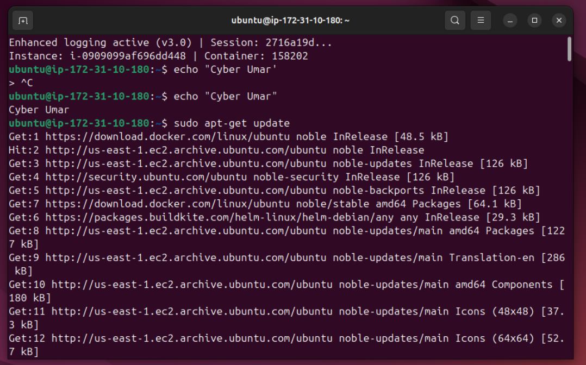
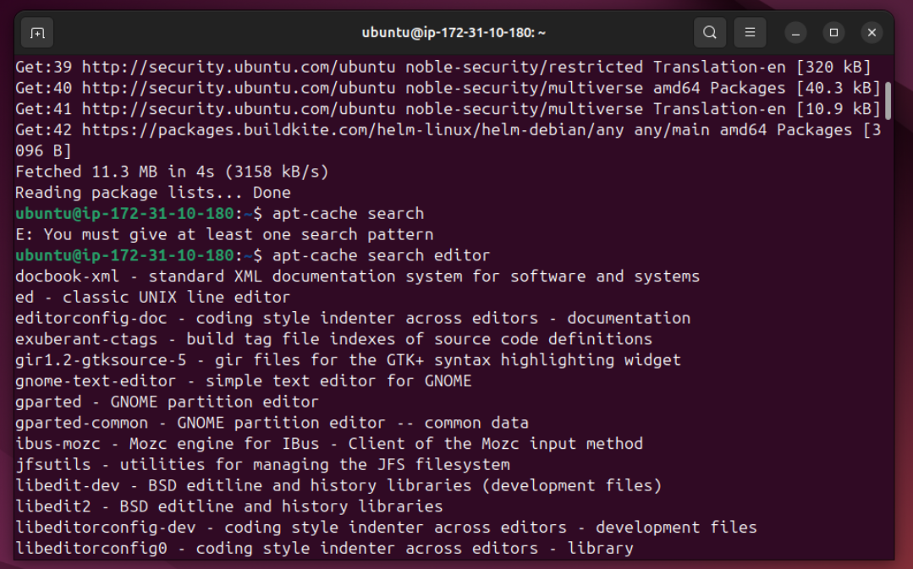
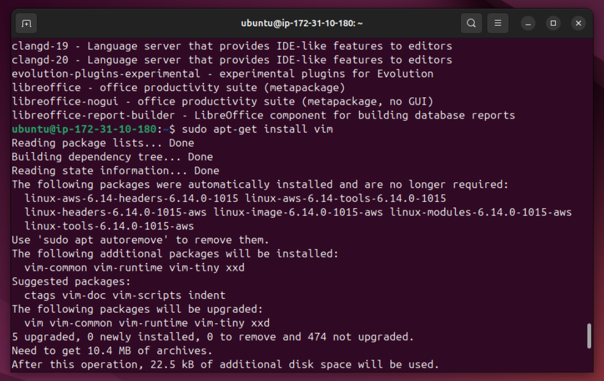
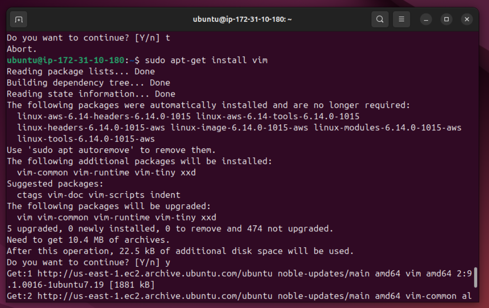
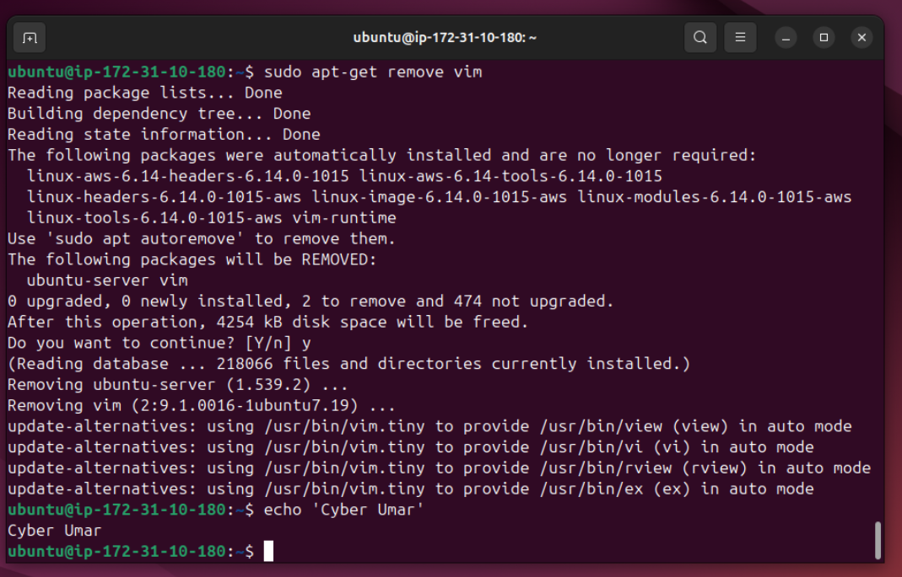

# Lab Name: 21.  Package Management APT 

## Objective

- Understand the basics of package management using APT (Advanced Package Tool).

## Tools Used

Ubuntu (Debian) Terminal Command Line Interface (CLI)

## Commands Used

` sudo apt-get update ` = to fetche the latest package information from the repositories (repos).

` apt-cache search <editor> `  = to search for specific keyword in list of packages.

` sudo apt-get install <vim> ` =  to install a specific package here it is **vim**

` sudo apt-get remove <vim> ` = to remove any specific package

**some command are used from the previous labs**

## Results

The results are attached below:

