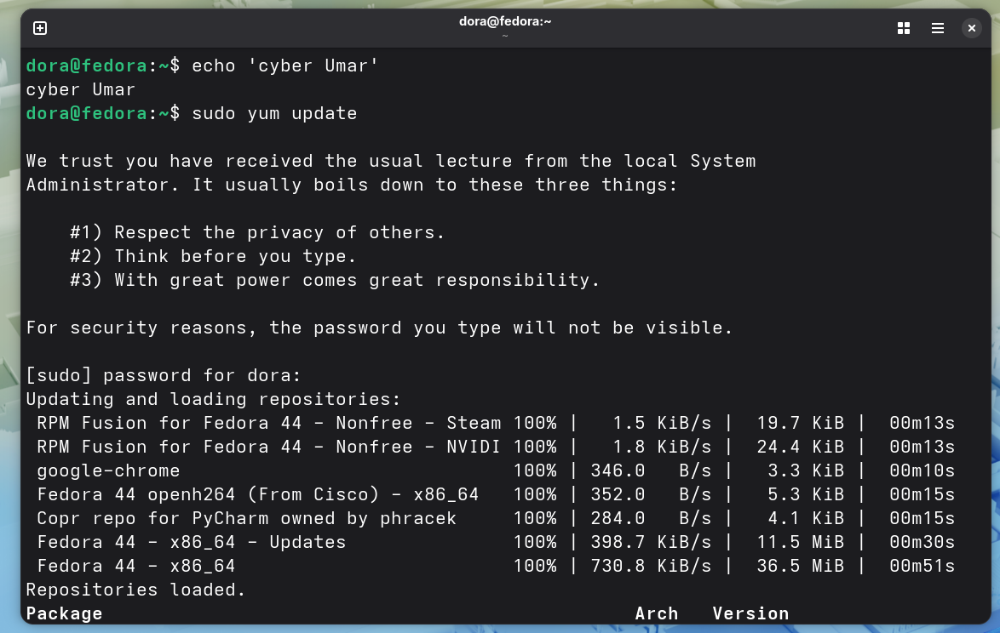
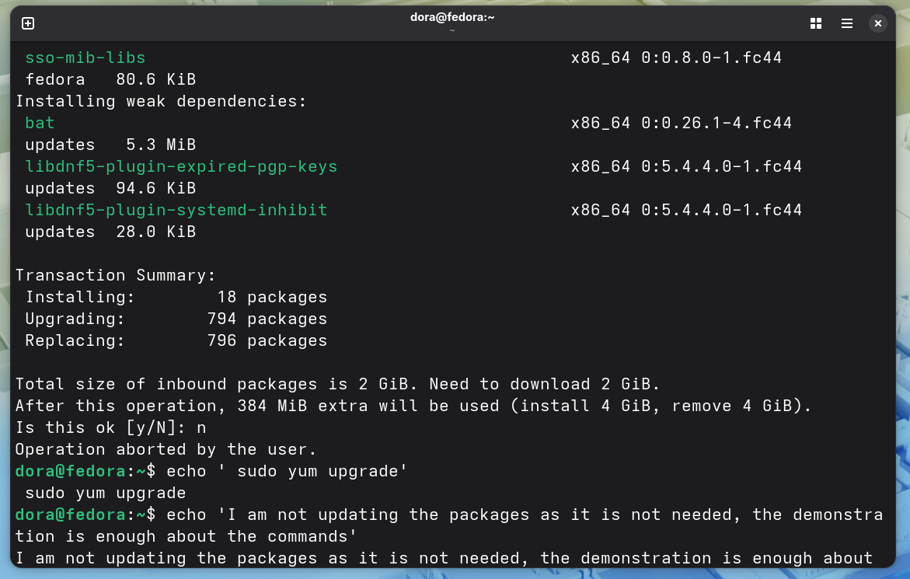
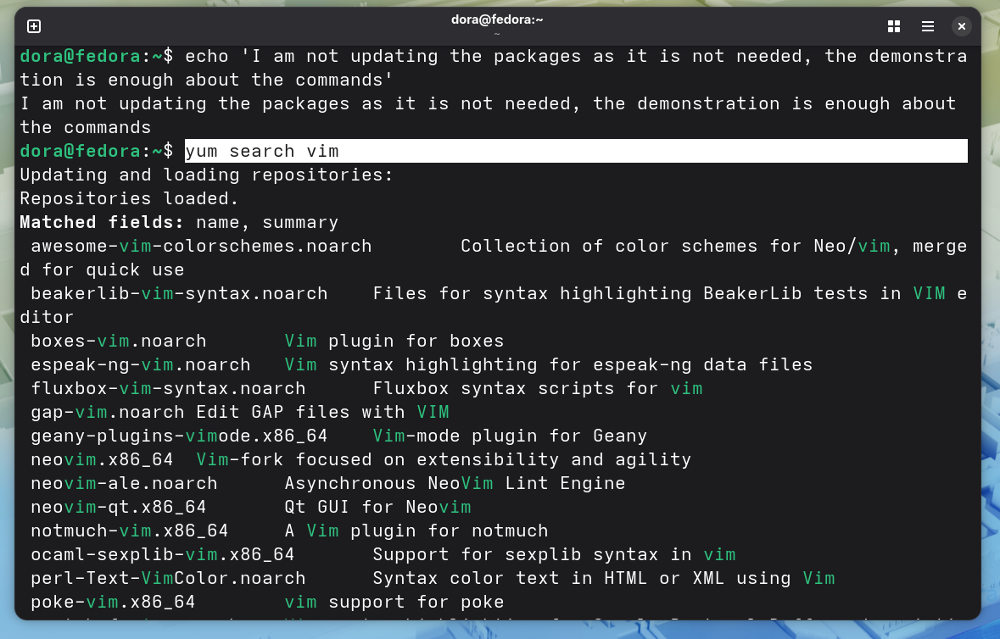
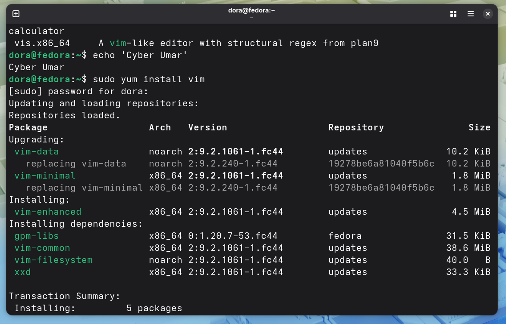
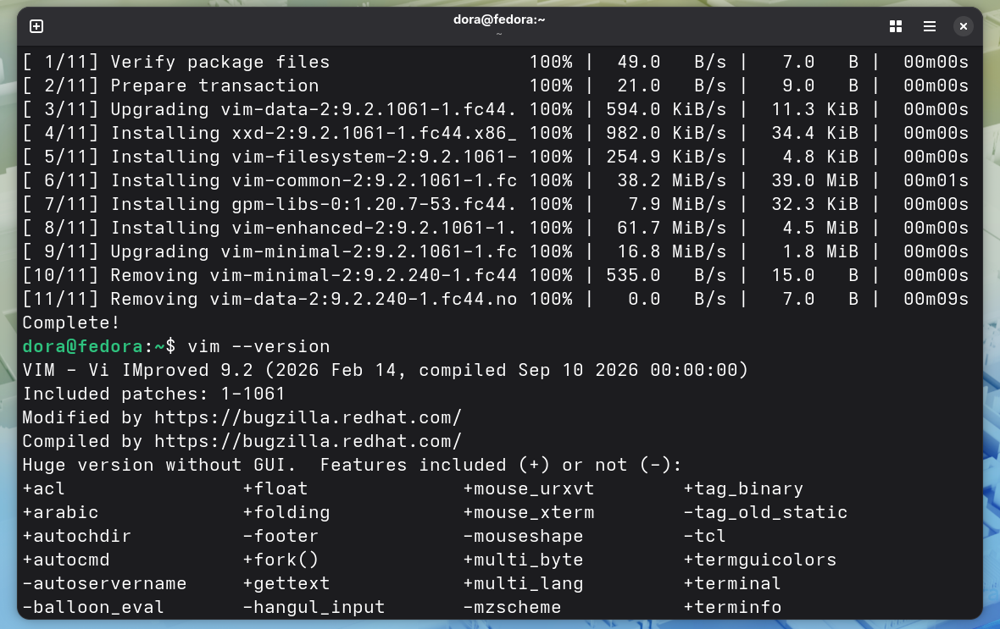
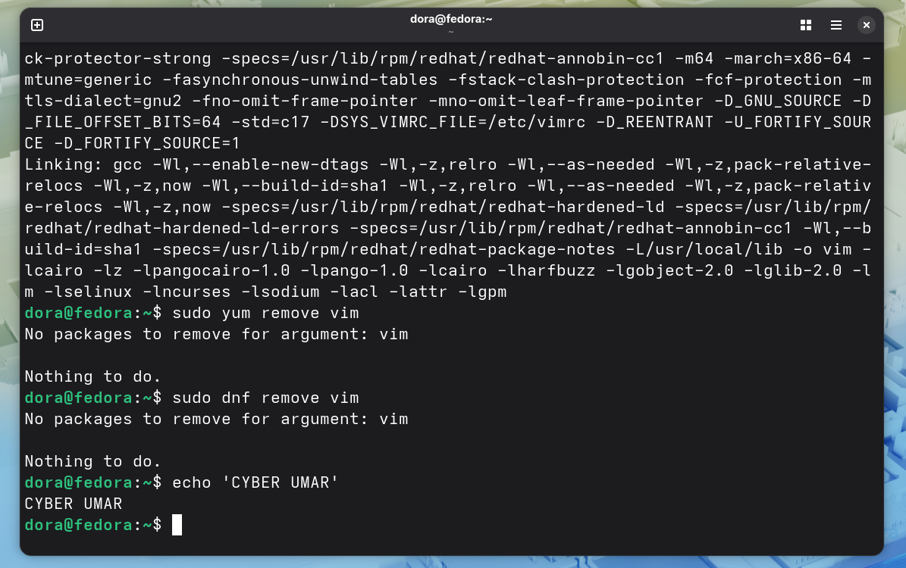

# Lab Name: 22.  Package Management YUM & DNF 

## Objective

- Understand basic package management concepts using YUM and DNF.

## Tools Used

RPM-based Linux distribution like CentOS, Fedora, or Red Hat Enterprise Linux (RHEL) CLI

## Commands Used

```
I have used a local VM in VMware of Fedora 44, to perform this lab. The alnafi.cloud was spinning up a Debian based OS i.e. Ubuntu where this lab can't be performed.

```

` sudo yum update ` or ` sudo dnf update` = to fetche the latest package information from the repositories (repos).

```
DNF stands for Dandified YUM. dnf is the modern, faster, and more memory-efficient successor to yum, featuring a completely rewritten dependency resolver (libsolv) for superior performance.
```

` sudo yum upgrade ` or ` sudo dnf upgrade`  = to upgrade the packages

` yum search vim ` or ` dnf search vim ` = to search any desired package here it is **vim**

` sudo yum install vim ` or ` sudo dnf intall vim ` = to install a specific package here it is **vim**

` vim --version ` = to confirm if the package is installed correctly

` sudo yum remove vim ` or ` sudo dnf remove vim ` = to remove a specific package here it is **vim**

**some command are used from the previous labs**


## Results

The results are attached below:











