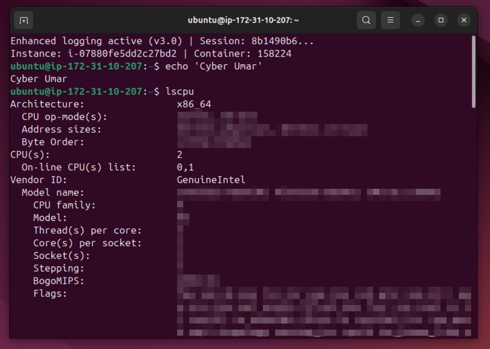
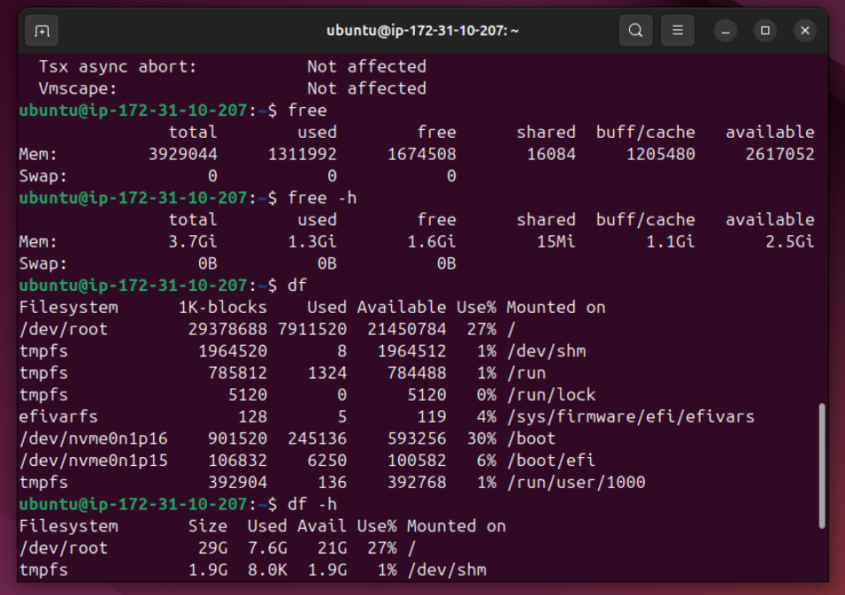
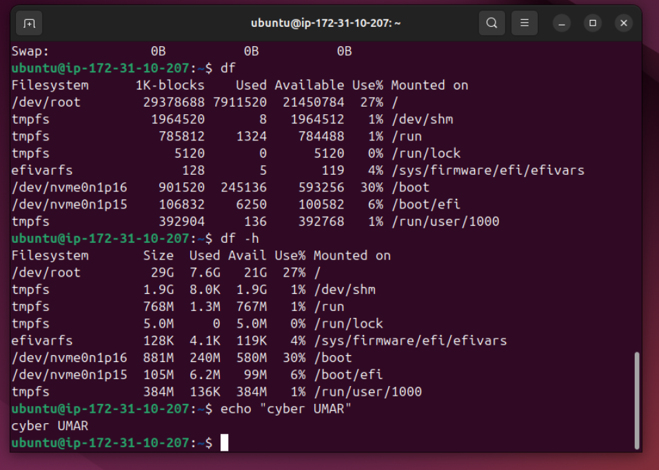

# Lab Name: 23.  System Hardware Information

## Objective

- Understand how to retrieve and interpret basic system hardware information.

## Tools Used

Ubuntu (Debian) Terminal Command Line Interface (CLI)

## Commands Used

` lscpu ` = to list down CPU information.

` free -h `  = to show RAM information along with swap (is for overflow purpose when physical RAM fills up. It uses memory in Hard Drive or SSD.). -h flag is for human readable format i.e. it converts the Bytes size into KB, MB or GB. It's easy to read.

` df -h ` =  to check disk space usage

**some command are used from the previous labs**

## Results

The results are attached below:

